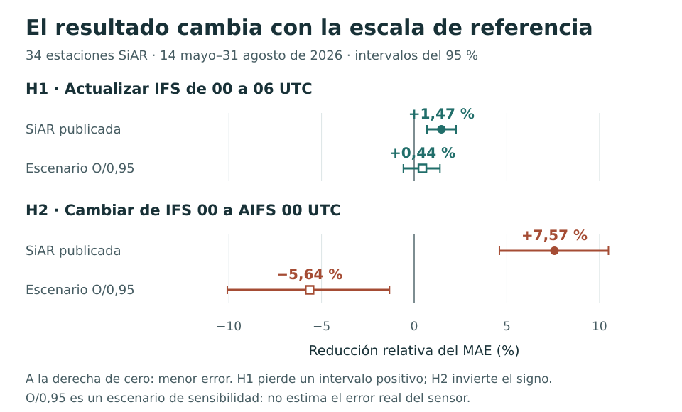

# IFS · AIFS · SiAR

**Pronosticar la radiación solar. Medir la mejora. Comprobar cuánto depende de la referencia.**

[](https://github.com/Lostmanu/ifs-aifs-siar/actions/workflows/ci.yml)
[](https://github.com/Lostmanu/ifs-aifs-siar/releases/tag/v1.0.2-cierre)

[Leer el estudio](docs/LECTURA.md) · [Reproducir](docs/REPRODUCIR.md) · [Auditar el método](docs/TRAZABILIDAD.md) · [Descargar los datos](https://github.com/Lostmanu/ifs-aifs-siar/releases/tag/v1.0.2-cierre)

Este estudio compara los pronósticos de radiación de **IFS y AIFS**, servidos por Open-Meteo, con **34 estaciones terrestres SiAR** en España. Evalúa dos decisiones: actualizar IFS de las 00 a las 06 UTC del día anterior y sustituir IFS por AIFS a igual ciclo.

**Hay una mejora medida frente a SiAR. Su magnitud y su interpretación cambian al modificar la escala de la referencia.** El proyecto está cerrado como investigación, con datos archivados, método documentado y reproducción sin conexión.

<picture>
  <source media="(prefers-color-scheme: dark) and (max-width: 600px)" srcset="docs/assets/resultado_principal_movil_oscuro.svg">
  <source media="(max-width: 600px)" srcset="docs/assets/resultado_principal_movil.svg">
  <source media="(prefers-color-scheme: dark)" srcset="docs/assets/resultado_principal_oscuro.svg">
  
</picture>

## Qué encontramos

Ventana primaria: **14 de mayo a 31 de agosto de 2026**, 110 días. Positivo significa que la segunda serie tiene menor error absoluto medio (MAE), normalizado por estación. Los dos pronósticos de cada contraste usan los mismos pares válidos.

| Decisión | Pares estación-día | Mejora relativa del MAE | IC95, bloques de 7 días |
|---|---:|---:|---:|
| Actualizar IFS: 00 → 06 UTC | 3.664 | **1,47 %** | [0,69; 2,26] |
| Cambiar de modelo: IFS 00 → AIFS 00 UTC | 3.697 | **7,57 %** | [4,60; 10,48] |

Ambas comparaciones superan Holm con los tres largos de bloque fijados (1, 7 y 14 días). Con **k = 0,95**, H1 baja a **0,44 %**, IC95 [−0,58; 1,39], y H2 cambia a **−5,64 %**, IC95 [−10,08; −1,33]. Ninguna supera todos los escenarios de escala preespecificados. Este ejercicio **no estima el error real del sensor**: en la métrica utilizada también equivale a multiplicar los pronósticos por k.

La secundaria añade un matiz: con k = 0,95 sus efectos son **+2,36 % y +5,33 %**. Esa extensión de escala es posterior al resultado; el intervalo de H1 incluye cero. Cambian a la vez periodo y versiones. El [contexto completo](docs/LECTURA.md) recoge también la comparación histórica de Urraca y el contraste previo con MeteoGalicia.

## Tres formas de entrar

| Quiero… | Empezar por… |
|---|---|
| Entender qué aporta y qué permite concluir | [Guía de lectura](docs/LECTURA.md): preguntas, diseño y límites |
| Obtener los mismos resultados | [Guía de reproducción](docs/REPRODUCIR.md), para Windows, Linux y macOS |
| Comprobar cifras, supuestos y procedencia | [Trazabilidad](docs/TRAZABILIDAD.md), [método congelado](estudio/metodo_fijado.json) e [informe completo](estudio/outputs/informe.md) |

## Comprobar el repositorio

Desde un clon, con Python 3.12, estos comandos comprueban el método, la selección y la documentación. Instalar NumPy requiere conexión o una copia local del paquete.

```bash
python -m pip install -r requirements.txt
python estudio/code/test_metodo.py
python estudio/code/verificar_seleccion.py
python herramientas/comprobar_enlaces.py
python herramientas/generar_figura_portada.py --check
```

La **reproducción completa** necesita el ZIP de datos: las respuestas originales `raw/` se distribuyen en la [versión v1.0.2](https://github.com/Lostmanu/ifs-aifs-siar/releases/tag/v1.0.2-cierre). La [guía](docs/REPRODUCIR.md) explica cómo verificarlo y ejecutarlo sin red.

La [revisión local del 23 de septiembre](docs/revision_20260923/informe.md) distingue comprobaciones ejecutadas, correcciones documentales y límites pendientes. El estado de GitHub Actions se consulta en la insignia de CI; comprobar números no certifica causas físicas.

## Qué se conserva

| Ruta | Contenido |
|---|---|
| [`estudio/code/`](estudio/code) | Análisis, pruebas y selección |
| [`estudio/outputs/`](estudio/outputs) | Informe, resultados y panel emparejado |
| [`estudio/datos/`](estudio/datos) | Observaciones y diagnósticos, incluidos los posteriores |
| [`docs/`](docs) | Guías, trazabilidad, auditorías y archivo |
| [Versiones descargables](https://github.com/Lostmanu/ifs-aifs-siar/releases) | Respuestas originales, recibos y paquetes conservados |

La especificación se congeló localmente antes de la descarga principal, **no mediante un prerregistro externo**. La exposición previa a parte de los datos y las desviaciones se declaran en el informe. El estudio no demuestra una causa de aerosoles, un fallo instrumental ni rentabilidad. La evaluación de pronósticos frente a MeteoGalicia era otro encargo, incompleto. [Decisión de cierre](CIERRE.md).

## Citar, reutilizar y señalar errores

Autor: **Manuel Beardo Campo**. Para citar la entrega, use [CITATION.cff](CITATION.cff) y conserve la versión del paquete. Código bajo [MIT](LICENSE); informes y figuras bajo CC BY 4.0. Los datos de terceros mantienen sus condiciones: [desglose por fuente](DERECHOS.md).

Las correcciones verificables son bienvenidas: [cómo comunicar un problema](CONTRIBUTING.md). Las versiones anteriores están en el [archivo](docs/ARCHIVO.md); los cambios, en [CHANGELOG.md](CHANGELOG.md).

Proyecto relacionado: [`prereg-tmax`](https://github.com/Lostmanu/prereg-tmax), otro encargo que aplica especificación congelada y evaluación temporal a la temperatura máxima. Comparte prácticas de investigación; sus conclusiones son independientes.

<details>
<summary>English summary</summary>

This reproducible study compares IFS and AIFS solar radiation forecasts served by Open-Meteo against 34 Spanish SiAR stations over 110 days. Updating IFS from 00 to 06 UTC reduces normalized MAE by 1.47%; replacing IFS 00 with AIFS 00 reduces it by 7.57%. Both pass the prespecified multiplicity procedure against published observations, but neither passes every prespecified common-scale sensitivity scenario. The scale test cannot identify whether discrepancies originate in observations or forecasts. The repository provides archived responses, a frozen specification, explicit deviations and offline reproduction. It does not establish operational availability or economic value.

</details>
