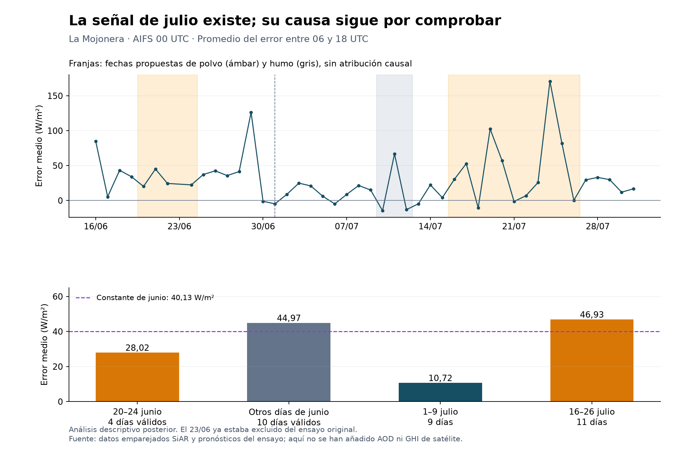

# Auditoría de la hipótesis de aerosoles y de la comparación con satélite

14 de septiembre de 2026 · La Mojonera y A Capela

**La hipótesis de aerosoles merece medirse, pero la auditoría recibida exagera lo que está demostrado.** El error aumenta en la ventana propuesta de julio. En cambio, la explicación de la constante de junio contradice nuestros datos; el argumento de bimodalidad no es válido; y añadir satélite ayuda a investigar el sensor, pero no identifica automáticamente quién se equivoca.

Esta revisión ejecuta el cruce de fechas solicitado y comprueba fuentes primarias. No modifica el ensayo original ni presenta junio–julio como una nueva validación independiente. Las fechas se propusieron después de conocer los errores. Todavía no se han descargado AOD ni irradiancia de satélite.



**Qué se ha calculado.** Se reutilizan las observaciones y pronósticos emparejados del ensayo: 14 días válidos de junio y 31 de julio por estación. Se promedian los bloques 06–12 y 12–18 UTC, con error definido como pronóstico menos sensor. Los W/m² expresan irradiancia media de esos bloques; el MAE se calcula sobre bloques, no sobre promedios diarios. AIFS 00 e IFS 00 son las salidas inicializadas a las 00 UTC del día anterior.

La corrección principal sigue siendo la media del error de junio, restada a los dos bloques diurnos con límite inferior cero. No es una regresión por hora, ni un modelo condicionado a aerosoles.

**Julio aporta una señal compatible con la hipótesis.**

| Ventana propuesta por la auditoría | Días | Error medio AIFS 00, W/m² | Error medio IFS 00, W/m² |
|---|---:|---:|---:|
| 1–9 julio, descritos como limpios | 9 | +10,72 | +5,07 |
| 10–12 julio, descritos como humo | 3 | +13,06 | −1,38 |
| 13–15 julio, descritos como limpios | 3 | +7,25 | +0,94 |
| 16–26 julio, descritos como polvo | 11 | +46,93 | +46,14 |
| 23–26 julio, subconjunto descrito como máximo | 4 | +69,73 | +60,58 |
| 27–31 julio, sin clasificación propuesta | 5 | +24,27 | +5,49 |

La fila 23–26 está contenida en 16–26: no son muestras independientes. Estas etiquetas no equivalen a una clasificación atmosférica validada en La Mojonera.

En AIFS, aplicar la constante de 40,13 W/m² lleva el MAE de 13,02 a 29,57 W/m² el 1–9 de julio; el 16–26 lo lleva de 52,26 a 44,33. Esto describe por qué una misma resta perjudica unos días y ayuda otros. No demuestra que el polvo cause la diferencia. Nubosidad, circulación, representatividad espacial y estado del sensor siguen siendo explicaciones posibles. Tampoco hay una respuesta uniforme durante toda la ventana: la figura muestra varios picos y días con error pequeño o negativo.

Para una corrección descendente ligada al exceso de aerosoles, la expectativa física sería mayor corrección cuando el AOD exceda su referencia, condicionada también a las nubes. La indicación anterior de corregir simplemente cuando el AOD sea bajo no se deduce de estos resultados. No fijamos un umbral con julio ya observado.

**La explicación de junio queda refutada en su aritmética.**

El 23 de junio ya estaba excluido del ensayo por falta de pronósticos de las 06 UTC necesarios para la muestra común. Por tanto, entre el 20 y el 24 entraron **cuatro días, no cinco**.

| Entrenamiento de La Mojonera, AIFS 00 | Días | Error medio |
|---|---:|---:|
| 20, 21, 22 y 24 de junio | 4 | +28,02 W/m² |
| Otros días válidos de junio | 10 | +44,97 W/m² |
| Conjunto original | 14 | +40,13 W/m² |

La identidad es `(4 × 28,017708 + 10 × 44,970625) / 14 = 40,126935`.

Los días señalados como calima **redujeron** la constante respecto a los demás. Quitarlos daría 44,97 W/m², una constante mayor. Esta retirada es solo una comprobación descriptiva: no reentrenamos ni atribuimos causalmente el resultado. La hipótesis general de aerosoles puede sobrevivir; la frase «cinco días con calima hicieron que la constante saliera 40» no queda respaldada.

**La documentación de partículas todavía necesita reconciliarse.**

Se descargaron los informes oficiales mensuales completos de [junio de 2026](https://www.juntadeandalucia.es/medioambiente/atmosfera/informes_siva/meses26/IMA2606.pdf) y [julio de 2026](https://www.juntadeandalucia.es/medioambiente/atmosfera/informes_siva/meses26/IMA2607.pdf), enlazados mediante el formulario del [portal de la Junta](https://www.juntadeandalucia.es/medioambiente/portal/areas-tematicas/atmosfera/la-calidad-del-aire/datos-e-informes-sobre-calidad-del-aire/informes-mensuales-de-calidad-del-aire). Se inspeccionaron las gráficas de Almería, página impresa 18 en ambos, y la tabla de PM10 de julio, página impresa 52.

Las gráficas muestran elevaciones de partículas en torno a las fechas discutidas; no permiten certificar todos los valores decimales ni atribuir polvo frente a humo. La tabla de julio, periodo acumulado enero–julio, publica máximas de la media de 24 horas de **99 µg/m³ para Bédar** y **97 para El Ejido**. El 96,6 citado para El Ejido es compatible con el redondeo de 97, pero la tabla no confirma su fecha. Los 219–254 atribuidos a Bédar no pueden tratarse como medias diarias del mismo conjunto validado sin explicar la discrepancia: podrían ser valores horarios, provisionales, excluidos después o de otra serie. No afirmamos cuál es la causa.

No se obtuvo la exportación diaria del visor público: la lectura con Python falló al verificar el certificado y el intento con el cliente de Windows agotó su tiempo de espera. Conservamos esta limitación. No se han convertido picos de PM10 regionales en AOD de La Mojonera.

**El fallo de una aproximación normal no demuestra bimodalidad.**

«Unimodal» significa un solo pico, no «normal» ni «simétrica». La media, la desviación y el MAE tampoco determinan por sí solos la forma de una distribución. Además, una constante que elimina el sesgo medio puede empeorar el MAE: sus objetivos son distintos.

Construimos un contraejemplo analítico: `error = X − 15,300076`, con `X` exponencial de escala `40,946689`. Su densidad tiene un único máximo. Tiene la misma media (+25,646613 W/m²) y MAE original (30,713387 W/m²) que La Mojonera en julio. Al restarle la constante utilizada, su MAE aumenta a 35,633279 W/m²: **empeora un 16,02 %**, frente al 14,23 % observado.

Es un ejemplo sintético de existencia, comprobado también por integración numérica; no reproduce la varianza ni demuestra que nuestros errores sean exponenciales o unimodales. Demuestra que la inferencia «la fórmula unimodal predice mejora, pero empeora, luego hay dos regímenes» es inválida. Puede haber regímenes físicos, pero hacen falta predictores y observaciones para sostenerlo.

También calculamos la curva real de constantes en A Capela: en julio, restar 110 W/m² lleva el MAE de 75,94 a 93,24, un empeoramiento del 22,77 %. En el rango explorado, el cruce superior con el MAE original está en unos 76,71 W/m². La afirmación 0–110 bajo normalidad no describe el conjunto observado. Estos valores son posteriores al resultado y no constituyen una regla predictiva.

**La física es plausible; las referencias necesitan más precisión.**

ECMWF confirma el uso de climatología de aerosoles en la mayoría de configuraciones del IFS y de aerosoles pronosticados en CAMS. Pero documenta una climatología con dimensión adicional de época desde 49r2, y el anuncio de 50r1 menciona una revisión. No es correcto describir toda esa evolución como la misma tabla mensual de 2003–2013. Esto mantiene la motivación para medir variabilidad de episodios, sin probar el sesgo de estas estaciones. [Documentación del esquema radiativo](https://confluence.ecmwf.int/spaces/ECRAD/pages/473845531/Aerosol-radiation+interactions+in+the+IFS), [actualización 50r1](https://www.ecmwf.int/en/newsletter/185/earth-system-science/upgrade-ifs-cycle-50r1).

El artículo localizado de Valenzuela para Granada 2005–2010 publica promedios de **24 horas**: forzamiento superficial medio de −18 a −21 W/m² y eficiencias de −65 a −74 W/m² por AOD, según sector de procedencia. No son los −40 y −150 citados. Convertirlos a otro intervalo exige explicitar y justificar el cálculo. Además, el forzamiento compara flujo neto con aerosoles frente a una atmósfera sin aerosoles; nuestro error compara GHI descendente pronosticada con un sensor, durante 06–18 UTC y con aerosoles climatológicos en la referencia física. La AOD 0,15 de esa celda y mes tampoco se ha medido aquí. El artículo sostiene el mecanismo, no una atribución cuantitativa de 50 W/m² a julio. [Valenzuela et al., 2012](https://acp.copernicus.org/articles/12/10331/2012/), páginas impresas 10331 y 10339.

La ausencia de AOD explícita no basta para concluir que AIFS carece de toda sensibilidad indirecta a episodios: puede aprender relaciones meteorológicas correlacionadas. La magnitud de su limitación debe medirse, y la procedencia del entrenamiento debe comprobarse para la versión concreta.

**Solcast no constituye una contradicción directa con nuestro resultado local.**

La publicación del 1 de abril de 2025 sí informa aproximadamente −8 % para AIFS y +2 % para IFS. Evalúa AIFS v1 durante sus primeras semanas, en la mayoría de capitales y con varios horizontes. Su referencia son los «actuals» de Solcast, derivados de satélite y modelización; no una red de piranómetros idéntica a SiAR. Nosotros medimos dos estaciones, otra época y versión, y otra agregación. Un promedio global negativo es compatible con errores positivos locales. Hay que armonizar esas diferencias antes de interpretar el signo como indicio de sensor defectuoso. [Análisis original de Solcast](https://www.solcast.com/blog/accuracy-analysis-ecmwfs-ai-model-for-solar-forecasting-performs-well).

**El satélite es una tercera estimación útil, no un árbitro infalible.**

SoDa confirma acceso gratuito con registro, hasta ayer y 500 peticiones por usuario y día. También explica que el producto se calcula con la versión y los datos de entrada más recientes; hay que conservar fecha de extracción y versión para reproducir una evaluación histórica. [Servicio oficial](https://www.soda-pro.com/web-services/radiation/cams-radiation-service), [notas de actualización](https://www.soda-pro.com/help/cams-services/release-notes-cams).

CAMS Radiation combina información de nubes por satélite con McClear y constituyentes atmosféricos de CAMS, incluidos aerosoles. Compararlo con AOD de CAMS no aporta una medición independiente de ese mismo aerosol. Hay errores de nubes, superficie y representatividad, y validaciones publicadas muestran sesgos del producto que varían entre estaciones. Esto no invalida el producto, pero impide usar coincidencias como demostraciones automáticas. [Marchand et al., 2019](https://asr.copernicus.org/articles/16/103/2019/).

Con modelo `M`, satélite `S` y observación `O`, cada serie contiene la irradiancia real más sus propios errores. Las diferencias `M−O`, `S−O` y `M−S` informan sobre errores relativos, pero la tercera es algebraicamente combinación de las otras dos. Sin una referencia adicional o supuestos contrastados no se identifican los tres sesgos absolutos.

| Patrón observado | Interpretación prudente | Comprobación complementaria |
|---|---|---|
| Modelo alto; satélite y SiAR cercanos | Aumenta la evidencia contra el modelo | Errores del producto satelital y dependencia de CAMS |
| Modelo y satélite cercanos; SiAR bajo | Aumenta la sospecha sobre SiAR | Mantenimiento, calibración y otras estaciones próximas |
| Divergencias asociadas a polvo | El aerosol puede intervenir | Separar atenuación atmosférica, depósito sobre sensor y nubes |
| Patrón regional o estación aislada | Ayuda a localizar el problema | Ni el ensuciamiento regional ni el error local de modelo quedan excluidos |

Un depósito de polvo puede afectar a varios sensores vecinos. Un modelo puede fallar solo en una estación por relieve o costa. Un mapa es útil, pero «geográfico = modelo, aislado = sensor» tampoco es una identificación causal.

**Cómo continuar con datos y con escala.**

1. Obtener AOD total y de polvo pronosticadas del día anterior. La solicitud existente ya contiene ambas; cambia el diagnóstico prioritario a AOD total, conservando polvo como contraste. «Hasta cinco días de horizonte» y «usar el día anterior» son compatibles. No se debe usar un análisis posterior como predictor disponible el día anterior.
2. Obtener GHI de CAMS Radiation en ambas coordenadas. Se han preparado dos solicitudes para los **565 días** ya cubiertos por AIFS, 25/02/2025–12/09/2026, en UTC y con resolución horaria. Revisar primero unidades e intervalos en junio–julio; esa revisión de medida no será un nuevo concurso entre correcciones. La solicitud se puede particionar si el servicio lo exige.
3. Emparejar el histórico con observaciones SiAR y examinar diferencias entre las tres fuentes, estados de calidad y coherencia con estaciones vecinas. Los 565 días de pronóstico descargados aún no son 565 días de errores validados. La ampliación debe separar versiones del modelo y respetar dependencia espacial y temporal.
4. Con ese conjunto, comparar un postproceso básico con otro que añada AOD, usando evaluación temporal externa y control de nubes. Cuantificar incertidumbre, episodios distintos y sensibilidad al sensor. Una correlación positiva aislada no demuestra causalidad; una nula en pocas semanas tampoco elimina la hipótesis.

No hace falta contratar datos ahora. Falta acceso personal a ADS o SoDa: no se encontraron los archivos estándar de configuración de ADS; no se han leído ni buscado secretos. Las solicitudes no se han enviado. Sus opciones se comprobaron contra el formulario público, pero las restricciones conjuntas y la aceptación por el servidor siguen pendientes.

La aportación que merece buscarse es **valor predictivo adicional de AOD en versiones concretas de AIFS, con una referencia observacional defendible**, no la mera existencia de una relación entre aerosoles y radiación. Ya hay literatura de corrección radiativa con aerosoles, por ejemplo para DNI en España; no es el mismo objetivo que nuestra GHI, pero impide presumir novedad de la idea general. [Estudio de postproceso de DNI, 2017](https://journals.ametsoc.org/view/journals/apme/56/6/jamc-d-16-0297.1.xml). No se presume monetización.

**Qué se entrega y qué prueba la verificación.** El archivo `comprobaciones.json` contiene todas las ventanas, ambas estaciones, las curvas de constantes y el contraejemplo. `verificacion.json` registra una reconstrucción independiente con aritmética decimal e integración numérica: 170 comparaciones pasaron, con diferencia máxima de 7,25 × 10⁻¹² en sus unidades numéricas. Son comprobaciones aritméticas; no certifican sensores ni física. El paquete reproducible conserva entradas emparejadas, parámetros, resultados previos, programas y recibos de las fuentes. Los datos originales y sus comprobaciones de calidad permanecen en la entrega del ensayo anterior.

El hallazgo verificable de esta revisión es más limitado y útil que el relato recibido: **hay una variación del error que debemos explicar, y ya sabemos qué inferencias no podemos usar para explicarla.**
