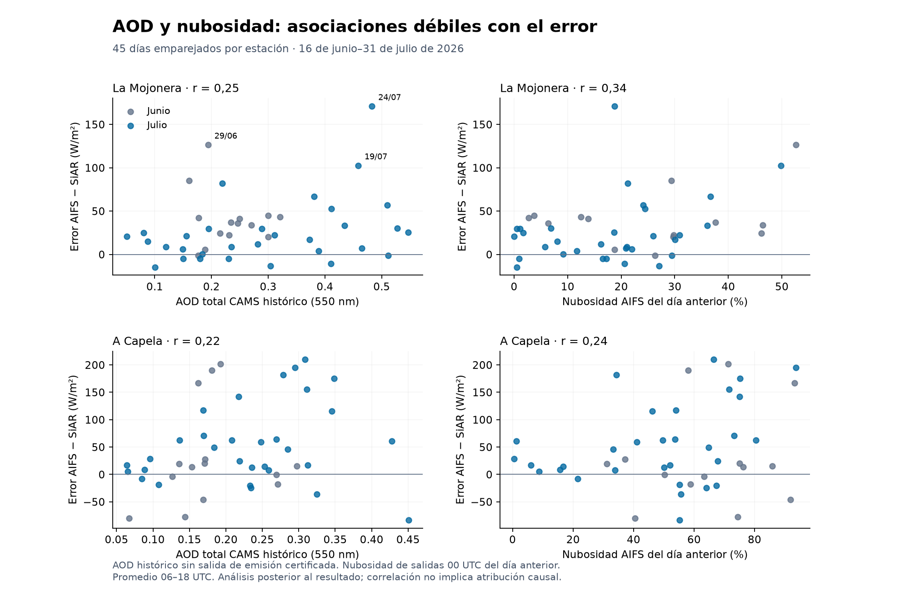
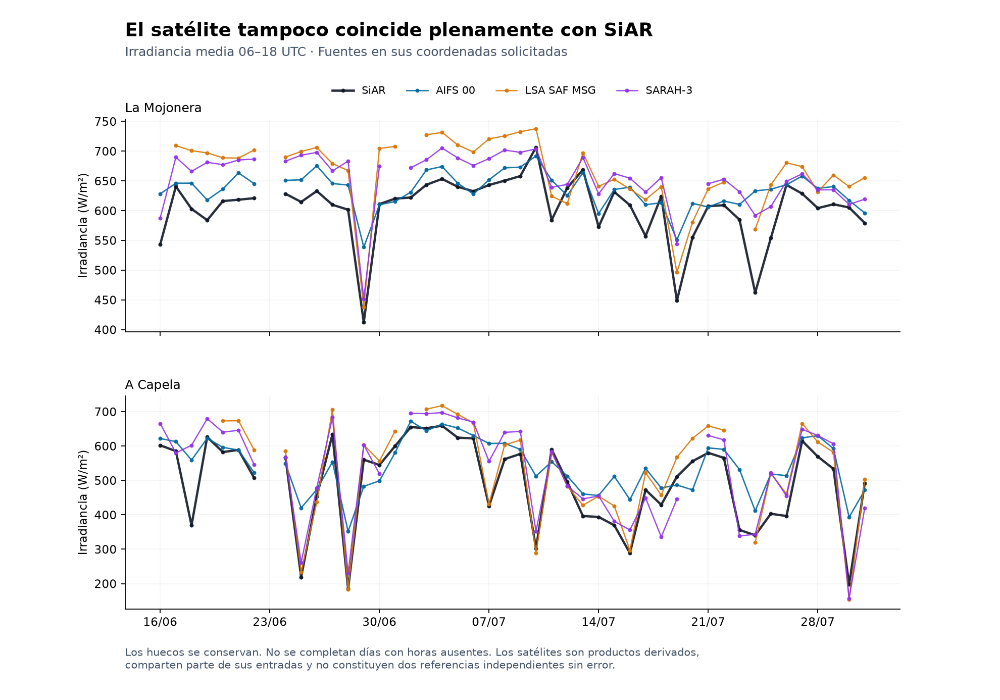

# Cruce de AOD, nubosidad prevista y radiación por satélite

14 de septiembre de 2026 · Análisis exploratorio de junio–julio de 2026

**El cruce está ejecutado. La asociación con aerosoles es modesta y la separación binaria «polvo o nube» no queda resuelta.** También se ha añadido una comparación real con dos productos satelitales. La prioridad pasa a comprobar la referencia observacional y la estabilidad del resultado antes de atribuir el sesgo a un mecanismo.

Corrijo mi limitación de acceso anterior: esta vía pública de Open-Meteo sí permite obtener AOD histórico y radiación por satélite sin cuenta. El acceso personal a ADS no bloquea este contraste histórico. Sigue pendiente obtener o certificar el AOD de una salida específica disponible el día anterior.

**Datos obtenidos y comprobaciones.**

- AOD total a 550 nm, polvo y PM10 de CAMS: las 1.104 horas solicitadas por estación, en los dominios automático y global. Son datos de un modelo, no medidas directas de partículas en la columna.
- Nubosidad y radiación: 184 respuestas de salidas individuales de AIFS e IFS, dos estaciones y 46 días. Cada salida se inicializa a las 00 UTC del día anterior. La radiación reconstruida coincide exactamente en los 360 bloques comparables con el ensayo previo.
- Radiación satelital de EUMETSAT: LSA SAF MSG y CM SAF SARAH-3, servidas por Open-Meteo. Se han descargado cuatro series; sus huecos se conservan. Son productos distintos de CAMS Radiation Service.
- El diario recibido contiene 90 filas, 45 por estación, y sus energías y errores coinciden con las entradas originales. El 23 de junio sigue excluido del ensayo; se conserva en el cruce con sus predictores, pero sin inventar un error observado.

Los resultados siguientes usan la irradiancia media 06–18 UTC y error `pronóstico − SiAR`. La AOD y la cobertura nubosa, que son instantáneas, se promedian integrando los 13 puntos horarios de 06 a 18 por trapecios. La radiación, media de la hora precedente, utiliza los registros 07 a 18. Se exige la ventana completa: no se rellenan huecos. [Definiciones de calidad del aire](https://open-meteo.com/en/docs/air-quality-api), [salidas individuales](https://open-meteo.com/en/docs/single-runs-api), [radiación satelital](https://open-meteo.com/en/docs/satellite-radiation-api).

**Resultado de AOD y nubosidad.**

| Asociación con el error diario de AIFS | La Mojonera | A Capela |
|---|---:|---:|
| AOD total CAMS histórico, Pearson | 0,248 | 0,224 |
| Intervalo 95 %, remuestreo en bloques de 3 días | −0,046 a 0,466 | −0,099 a 0,510 |
| Intervalo 95 %, bloques de 7 días | −0,021 a 0,435 | −0,077 a 0,462 |
| AOD, ajustando linealmente por nubosidad AIFS | 0,162 | 0,189 |
| Nubosidad prevista AIFS, Pearson | 0,339 | 0,237 |

Son 45 pares por estación, con 5.000 réplicas por longitud de bloque. Los intervalos son exploratorios y condicionados a estas fuentes. Junio y julio ya habían sido examinados; no son una nueva evaluación fuera de muestra. El control de cobertura nubosa es limitado: no mide el error de posición, el espesor óptico ni las nubes realmente observadas.

En La Mojonera, la correlación es −0,165 en los 14 días de junio y +0,374 en los 31 de julio. Al retirar cada día por turno, varía entre 0,140 y 0,314; el mínimo corresponde a retirar el 24 de julio. Esto muestra sensibilidad al episodio y al periodo. No demuestra ausencia de un efecto de aerosoles.

| Tercil de AOD en La Mojonera, definido con toda esta muestra | Días | AOD media | Error AIFS medio | Nubosidad AIFS media |
|---|---:|---:|---:|---:|
| Bajo | 15 | 0,144 | +22,10 W/m² | 14,75 % |
| Medio | 15 | 0,253 | +26,99 W/m² | 21,16 % |
| Alto | 15 | 0,436 | +41,36 W/m² | 24,76 % |

El error aumenta entre terciles, pero también cambia la nubosidad. Los umbrales son descriptivos, calculados después de conocer los resultados. No son una regla operativa. El cuadrado de la correlación, aproximadamente 6 %, describe un ajuste lineal en esta muestra; no es el porcentaje del sesgo causado por aerosoles ni una medida del beneficio de corregirlos.



**Los seis días discutidos, con datos nuevos.**

| Día en La Mojonera | Error AIFS | AOD CAMS histórica | Cobertura prevista AIFS | Cobertura prevista IFS |
|---|---:|---:|---:|---:|
| 24 julio | +170,93 W/m² | 0,483 | 18,75 % | 4,88 % |
| 25 julio | +82,10 W/m² | 0,219 | 21,25 % | 20,25 % |
| 11 julio | +66,88 W/m² | 0,381 | 36,67 % | 17,63 % |
| 29 junio | +126,42 W/m² | 0,194 | 52,63 % | 57,67 % |
| 19 julio | +102,50 W/m² | 0,459 | 49,79 % | 43,42 % |
| 16 junio | +85,02 W/m² | 0,161 | 29,38 % | 46,08 % |

El 19 de julio ilustra por qué PM10 superficial no sustituye a AOD en columna: aquí la AOD modelada sí es alta dentro de la muestra. El 25 de julio, en cambio, no tiene la misma carga que el 24. Y los tres días descritos como «modelo a cielo despejado» no tienen cobertura prevista cero en AIFS. Un cociente radiación/cielo despejado cercano a uno no es una medición de ausencia de nubes; la cobertura, altura, espesor óptico y posición respecto al sol son magnitudes distintas.

La combinación «AOD alta y poca nubosidad prevista» justifica investigar aerosoles, pero también puede coexistir con nubes no previstas. «AOD baja» no prueba que el resto sea nube: ese AOD procede de un modelo y puede equivocarse, y permanecen otras fuentes de discrepancia, incluido el sensor. No se asigna una causa única a ninguno de estos seis días.

**Qué añade la comparación con satélite.**

Para comparar sin cambiar de muestra entre fuentes, esta tabla usa solo días completos comunes a SiAR, AIFS, IFS y los dos productos satelitales. Muestra diferencia media respecto a SiAR; no MAE.

| Estación | Días comunes | AIFS − SiAR | IFS − SiAR | LSA SAF MSG − SiAR | SARAH-3 − SiAR |
|---|---:|---:|---:|---:|---:|
| La Mojonera | 40 | +29,63 | +22,99 | +58,80 | +49,49 |
| A Capela | 37 | +49,19 | +42,47 | +37,76 | +31,66 |

Todas las diferencias están en W/m² medios de 06–18 UTC. En La Mojonera, ambos productos satelitales quedan incluso por encima de AIFS en promedio. Esto impide afirmar que el satélite confirma sin más el valor de SiAR. Tampoco demuestra que el piranómetro esté sucio: no son referencias perfectas ni independientes entre sí.

El 29 de junio los valores son SiAR **412,24**, AIFS **538,67**, LSA SAF **437,97** y SARAH-3 **451,54 W/m²**. Los satélites recogen buena parte de la caída que AIFS no reproduce. El 24 de julio son **462,15**, **633,08**, **568,58** y **591,96**, respectivamente: ambos satélites quedan entre el sensor y AIFS, todavía a más de 100 W/m² de SiAR. Una regla de coincidencia binaria no describe ese día.

SARAH-3 utiliza climatología de aerosoles MACC, con ajustes para cargas altas detectadas por su algoritmo. Su radiación es una estimación que combina imágenes y modelización; no una medida independiente de la atenuación por aerosoles de ese día. LSA SAF y SARAH-3 usan observaciones MSG, por lo que dos productos no equivalen a dos instrumentos independientes. [Descripción primaria de SARAH-3, sección 2.5.4](https://essd.copernicus.org/articles/16/5243/2024/essd-16-5243-2024.html), [productos radiativos LSA SAF](https://lsa-saf.eumetsat.int/en/data/products/radiation/).

En esta descarga no se obtuvieron los indicadores nativos de calidad, máscara de nubes ni AOD auxiliar de LSA SAF. Los controles del archivo servido no sustituyen su inspección. Las fuentes representan píxeles distintos de una medida puntual en superficie. No se ha recalibrado ningún sensor ni convertido estas diferencias en factores de corrección.



**Qué se puede cerrar del mensaje recibido.**

- Se reproducen el diario de radiación, la correlación PM10 contemporánea de El Ejido (0,211, 44 pares) y la pendiente error–atenuación de La Mojonera (0,58546).
- El PM10 recibido carece de recibos de su fuente y de una definición completa de las columnas `00` y `09`. Se ha comprobado su aritmética, no certificado su origen. Con la columna `00`, error del día frente a PM10 dos días después da 0,355 con 42 pares. Los valores futuros no son predictores disponibles el día anterior, y escoger el mejor desfase después de mirar no es validación predictiva.
- La pendiente 0,59 no identifica una fracción física no modelada. Si `e = M − O` y `a = C − O`, ambas variables contienen la misma observación. La pendiente depende de esas covarianzas, además de la habilidad del modelo. El cálculo se reproduce, pero el salto a atribución causal no queda certificado por su intervalo.
- Las comprobaciones detalladas de reloj y de los tres modelos de cielo despejado no se han podido reproducir desde este envío: faltan su programa, los criterios de selección y las series de esos tres modelos. El diario contiene una sola referencia diaria de cielo despejado. Se conservan los controles de reloj del ensayo anterior, sin ampliarlos a conclusiones nuevas.
- La nubosidad prevista de A Capela hace plausible un problema relacionado con nubes. No confirma por sí sola que toda discrepancia proceda de nubes subestimadas, especialmente ante la diferencia persistente entre SiAR y los productos satelitales.

**Correcciones aplicadas al programa.** Se conserva intacto el archivo recibido y se ejecuta una implementación revisada que: etiqueta AOD como histórica sin salida D−1 certificada; fija el dominio global y mantiene el automático como sensibilidad; distingue PM10 modelado y recibido; exige ventanas completas; integra según el tipo de variable; evita clasificar valores ausentes como «AOD alto»; comprueba fechas, coordenadas y radiación contra el ensayo; y conserva respuestas y recibos. Replicar el promedio 06–17 del programa recibido da correlación AOD–error de 0,24880 en La Mojonera: el cambio de integración no explica la conclusión.

**Siguiente trabajo útil.** El acceso gratuito está resuelto para este diagnóstico. Conviene extender el contraste entre productos y estaciones próximas al histórico disponible, revisar metadatos de los sensores y obtener indicadores nativos de calidad/nubes antes de atribuir el sesgo. Para probar una mejora anticipable, se necesita AOD de salidas emitidas con la antelación exigida, más una comparación temporal externa de postproceso básico frente a postproceso con AOD. La correlación de estas semanas no justifica descartar CAMS, elegirlo como predictor definitivo ni comprometer cinco meses con la explicación del polvo.

Los archivos entregados incluyen el cruce completo, resultados, ambas figuras y un paquete para repetir el cálculo sin red. El original y el ensayo previo permanecen intactos. Los proveedores son SiAR/MAPA, ECMWF/CAMS, EUMETSAT LSA SAF y CM SAF, a través de Open-Meteo para las descargas nuevas; el PM10 de El Ejido y la referencia de cielo despejado proceden del material recibido.
