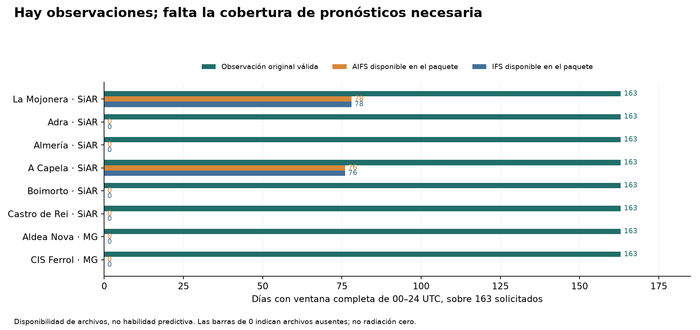
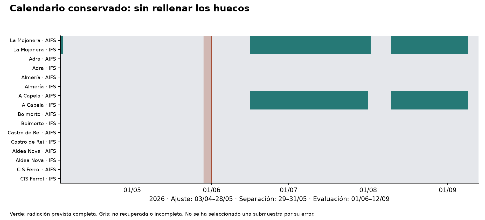

# AIFS/IFS frente a MeteoGalicia: ensayo temporal preparado, evaluación pendiente

14 de septiembre de 2026 · Continuación de la auditoría de referencias · 8 estaciones · 163 días de calendario

**No se ha podido completar la evaluación predictiva solicitada.** Hay observaciones originales suficientes, pero el servicio de salidas individuales devolvió errores y tiempos de espera agotados al recuperar los pronósticos necesarios. No hay resultados nuevos de MAE, sesgo o mejora contra MeteoGalicia. Presentar la ausencia de resultados como fracaso del corrector, o como confirmación del sesgo, sería incorrecto.

**Recomendación: no avanzar al desarrollo comercial de una corrección con esta evidencia.** La decisión científica sigue pendiente del contraste contra MeteoGalicia. El trabajo restante está delimitado: recuperar los pronósticos que faltan y ejecutar el protocolo ya fijado, sin cambiar fechas, estaciones o métodos según los errores que aparezcan. La interrupción de acceso no demuestra que la oportunidad sea inviable.

## Qué se ha conservado y qué se ha hecho

Se leyeron completos los informes `informe_cruce.md` e `informe_referencia.md`. Sus conclusiones físicas se trataron como hipótesis. Se copiaron las entradas necesarias y **304 respuestas anteriores de salidas de las 00 UTC** para La Mojonera y A Capela, junto a sus recibos originales; no se volvió a construir el estudio desde cero. Los archivos anteriores permanecen intactos, comprobados mediante hashes en la entrega.

Se reconstruyeron las observaciones desde las respuestas guardadas de SiAR y MeteoGalicia. Hay **1.304 observaciones utilizables: ocho estaciones × 163 días**, del 3 de abril al 12 de septiembre de 2026. Las dos estaciones de MeteoGalicia tienen en todos esos días el código 1, dato válido original. No se han rellenado huecos ni sustituido fallos de descarga por radiación cero.

La comprobación contra la auditoría anterior abarca **4.520 valores de calendario** en sus 565 días y ocho estaciones, incluidas las ausencias. Dentro de la nueva ventana se verificaron de nuevo **1.304 conversiones observacionales** mediante aritmética decimal, y **308 integrales de pronóstico** de ventanas completas disponibles. Son controles de integridad y aritmética; no prueban exactitud instrumental ni capacidad predictiva.

## Protocolo fijado antes de calcular errores nuevos

El protocolo inicial se guardó con fecha y hash a las 13:45 UTC. La versión aplicable, `protocol_v2.json`, se fijó a las 13:47 UTC, **antes de unir observaciones y pronósticos o calcular errores**. La única enmienda adelantó el final del ajuste del 31 al 28 de mayo, para no utilizar el total del 31 de mayo al emitir el pronóstico del 1 de junio. Ambas versiones y sus recibos se conservan. La aclaración editorial en protocol_clarification.md identifica una frase heredada del protocolo inicial; los campos de fechas de la versión 2 son los aplicables. Es una separación temporal retrospectiva documentada, no un registro externo ni una validación prospectiva: los resultados anteriores de junio–julio y las discrepancias entre referencias ya se conocían.

| Elemento | Decisión previa |
|---|---|
| Ajuste | 3 abril–28 mayo 2026: 56 días de calendario |
| Separación | 29–31 mayo: no se usan para ajustar ni evaluar |
| Evaluación | 1 junio–12 septiembre 2026: 104 días |
| Sensibilidades temporales | Junio–julio; agosto–12 septiembre; excluir además los dos primeros días de evaluación |
| Pronóstico | AIFS Single 0,25° e IFS 0,25°, salida 00 UTC de D−1, celda más próxima a cada estación |
| Magnitud | Energía global horizontal de 00–24 UTC, kWh/m²/día |
| Comparabilidad | Mismas fechas completas en las ocho estaciones y ambos modelos para ajustar y evaluar todos los métodos |
| Cobertura mínima | Al menos 40 días comunes de ajuste, 60 de evaluación y 90 % de observaciones originales por estación |
| Método principal | Restar el error medio de ajuste de cada estación y modelo; limitar la predicción a un mínimo de cero |
| Sensibilidad básica | Multiplicar por suma de observaciones / suma de pronósticos del ajuste, sin búsqueda de parámetros |
| AOD | No se utiliza sin descarga de una salida y acreditación de disponibilidad antes de la decisión |

**Corrección de lectura del calendario:** la ventana 3 de abril–28 de mayo contiene 56 días, no los 59 de la ventana inicial hasta el 31 de mayo. Los programas obtienen los tamaños desde las fechas; no usan el tamaño escrito en el texto para cortar datos.

La selección espacial es la heredada: seis SiAR y las dos MeteoGalicia más próximas con irradiación disponible, Aldea Nova y CIS Ferrol. Cajamar–PITA permanece documentada como excluida porque su serie publicada termina el 21 de abril; esta insuficiencia era conocida antes de descargar nuevos pronósticos. No se ha elegido ninguna estación por el error del modelo.

Para MeteoGalicia se mantiene `IRD_SUM_1.5m`, exclusivamente código 1, dividido por 360; para SiAR, el total publicado en MJ/m² dividido por 3,6. El código de calidad no equivale a un certificado de calibración. [Definición oficial de MeteoGalicia](https://www.meteogalicia.gal/datosred/infoweb/meteo/docs/rss/JSON_EstacionsDiarios_es.pdf).

## Salida, antelación y límite del archivo

La petición identifica la inicialización de las 00 UTC de D−1. Se requieren las 24 medias horarias precedentes, con marcas D 01 UTC a D+1 00 UTC: extremos de plazo **+25 a +48 horas**. La ventana física comienza en +24 horas. Se suman y dividen por 1.000. Se conserva la URL de cada petición, la respuesta y su hash. La resolución horaria servida incluye interpolación de la distribución de AIFS e IFS; este ensayo evalúa esas series servidas y no afirma que sean registros horarios nativos.

La hora de inicialización **no es la hora de publicación**. Se define como referencia de uso una decisión a las 12 UTC de D−1; no se ha certificado la primera disponibilidad histórica de cada salida ni la de cada observación de ajuste. El último total usado para ajustar termina el 29 de mayo a las 00 UTC, 60 horas antes del primer corte nominal. Eso evita usar observaciones futuras, pero no documenta sus demoras de publicación. [Contrato de salidas individuales](https://open-meteo.com/en/docs/single-runs-api), [distribución e interpolación ECMWF](https://open-meteo.com/en/docs/ecmwf-api).

En esta vía pública de Open-Meteo, AIFS está documentado desde la inicialización del 2 de abril de 2026. Las consultas del 28 de febrero de 2025, 14 de enero y 1 de abril de 2026 respondieron que la salida no estaba disponible; la del 2 de abril sí funcionó en la comprobación inicial. Por eso se fijó el primer día verificable en el 3 de abril. **Este límite no significa que AIFS no existiera antes**: ECMWF documenta histórico en MARS, con otras condiciones de acceso. Tampoco los 565 días históricos anteriores acreditan una salida fija. [Acceso oficial a AIFS e histórico](https://confluence.ecmwf.int/spaces/UDOC/pages/599165903/AIFS+How+To+Access+AIFS+model+output+data).

## Bloqueo de descarga y cobertura efectiva

Se conservaron **32 intentos nuevos** al servicio de salidas individuales: 2 respuestas correctas de las comprobaciones iniciales, 3 respuestas de salida no disponible, 11 errores HTTP 500, 4 respuestas por exceso de concurrencia y 12 tiempos de espera agotados. Las consultas múltiples se interrumpieron; también fallaron consultas individuales, de un solo modelo y de radiación sin nubosidad. La última consulta aislada, con margen de espera de 180 segundos, terminó con HTTP 500 a las 13:57:46 UTC. Los fallos no se interpretan como ausencia climatológica de datos.

Los tiempos de recuperación se guardan en UTC y el registro `request_log.csv` contiene las URLs y hashes. El cuerpo vacío de una petición agotada tiene un hash de archivo vacío y un estado de transporte nulo; no es una respuesta meteorológica válida. El descargador preparado para continuar opera en serie, conserva cada intento y se detiene ante errores consecutivos o un límite de concurrencia.

| Estación | Red | Observaciones válidas /163 | Días AIFS completos conservados | Días IFS completos conservados |
|---|---|---:|---:|---:|
| La Mojonera | SiAR | 163 | 78 | 78 |
| Adra | SiAR | 163 | 0 | 0 |
| Almería | SiAR | 163 | 0 | 0 |
| A Capela | SiAR | 163 | 76 | 76 |
| Boimorto | SiAR | 163 | 0 | 0 |
| Castro de Rei | SiAR | 163 | 0 | 0 |
| Aldea Nova | MeteoGalicia | 163 | 0 | 0 |
| CIS Ferrol | MeteoGalicia | 163 | 0 | 0 |

**Días comunes para ajustar: 0. Días comunes para evaluar: 0.** Los pronósticos antiguos útiles de dos estaciones no satisfacen la comparación de referencias. El programa detiene el ajuste en esta situación y no produce parámetros ni una tabla de habilidad sobre una muestra alternativa.

## Qué evaluación queda pendiente

El cálculo está preparado para publicar MAE, sesgo firmado `pronóstico − observación`, sesgo relativo y reducción de MAE, siempre con fechas idénticas entre métodos y referencias. Las agrupaciones son estación, Galicia–SiAR, Galicia–MeteoGalicia, Galicia conjunta y Almería, con el mismo peso por estación y fecha. Las estaciones próximas no se tratarán como réplicas independientes.

El desglose meteorológico usa nubosidad **prevista por AIFS**, media trapezoidal 06–18 UTC: menos de 20 %, de 20 a 80 % y más de 80 %. Para comparar redes gallegas se fija A Capela como punto común de clasificación; para Almería, La Mojonera. En cada estación también se usa su propia predicción. Estos regímenes no son observaciones de nubes ni diagnósticos de aerosoles.

Los intervalos previstos remuestrean días de calendario en bloques de 7 y 14 días, con 5.000 réplicas, usando conjuntamente las estaciones y preservando los huecos. Son intervalos condicionales a este periodo y a los parámetros ajustados, sin convertir comparaciones múltiples en una confirmación independiente. Se marca como descriptiva toda celda con menos de 20 días.

Se evaluará también transferir a los dos puntos de MeteoGalicia los parámetros ajustados con A Capela, y la sensibilidad recíproca. Es una prueba de portabilidad entre emplazamientos. **No es sustituir el sensor en un punto idéntico**: la distancia, altitud, relieve y representación de la celda siguen confundiendo las diferencias de red.

El protocolo exige beneficio del corrector principal en ambas MeteoGalicia, también en agosto–septiembre, y un intervalo agregado positivo con ambas longitudes de bloque antes de considerar respaldada una mejora general. No se escogerá el corrector secundario porque resulte ganador sin una validación adicional.

La evaluación propuesta cubre 92 días de verano meteorológico y solo 12 de otoño. Primavera es principalmente ajuste; invierno no está cubierto. **No hay base para certificar estabilidad anual**, incluso si se recupera todo este archivo. No se presentan resultados de entrenamiento como evidencia de generalización estacional.

## Cuatro conclusiones separadas

| Pregunta | Estado al cierre de esta entrega |
|---|---|
| Capacidad predictiva | Pendiente. No hay MAE, sesgo o reducción de error nuevos frente a MeteoGalicia. |
| Discrepancia entre referencias | Se mantienen los resultados de la auditoría anterior; no se han convertido en correcciones instrumentales. |
| Hipótesis física | No se ha identificado causalidad de aerosoles, errores de nubes ni fallos de sensores. |
| Utilidad económica | No cuantificable con este ensayo incompleto. No se ha demostrado ahorro ni disposición a pagar. |

El catálogo CAMS sí documenta pronósticos con ciclos 00 y 12 UTC; eso no acredita que hayamos descargado AOD emitida con la antelación requerida. La serie histórica ya disponible queda excluida del modelo operativo. No se ha ajustado una corrección con AOD ni usado una correlación retrospectiva como regla. [Catálogo oficial CAMS](https://ads.atmosphere.copernicus.eu/datasets/cams-global-atmospheric-composition-forecasts?tab=overview).

Si una validación posterior mostrara una mejora sólida, la decisión candidata sería ajustar una previsión de producción o un programa de entrega de una planta fotovoltaica. Un operador de planta o su representante podría evaluar ese servicio. Son posibles usuarios, **no compradores identificados**. Para cuantificar valor hacen falta producción y configuración de la planta, decisiones a una hora concreta, precios y costes de desvío. El MAE de irradiación diaria no se convierte directamente en MWh de planta ni en euros; tampoco demuestra precisión horaria.

## Entrega y verificaciones

Se entregan el calendario completo, las observaciones originales, los pronósticos reutilizados, respuestas nuevas y fallidas, recibos, criterios, dos figuras y programas de reproducción sin red. La verificación usa código separado dentro de esta misma tarea, no un revisor externo. Comprueba hashes, conversiones decimales, extremos horarios y el bloqueo por cobertura insuficiente. Las funciones de métricas y remuestreo pasan ejemplos numéricos conocidos; **la rama de evaluación completa aún no se ha ejecutado con una muestra empírica suficiente**.

El paquete reproduce exactamente el estado pendiente. No promete reproducir resultados de una evaluación que no se pudo realizar. `LEEME.md` explica cómo repetir la comprobación y cómo reanudar únicamente las descargas que faltan, sin modificar el protocolo ni los materiales anteriores.
