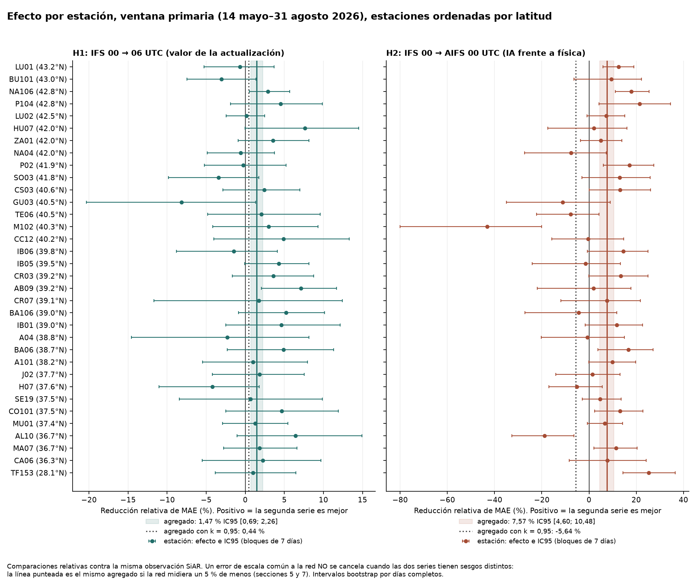
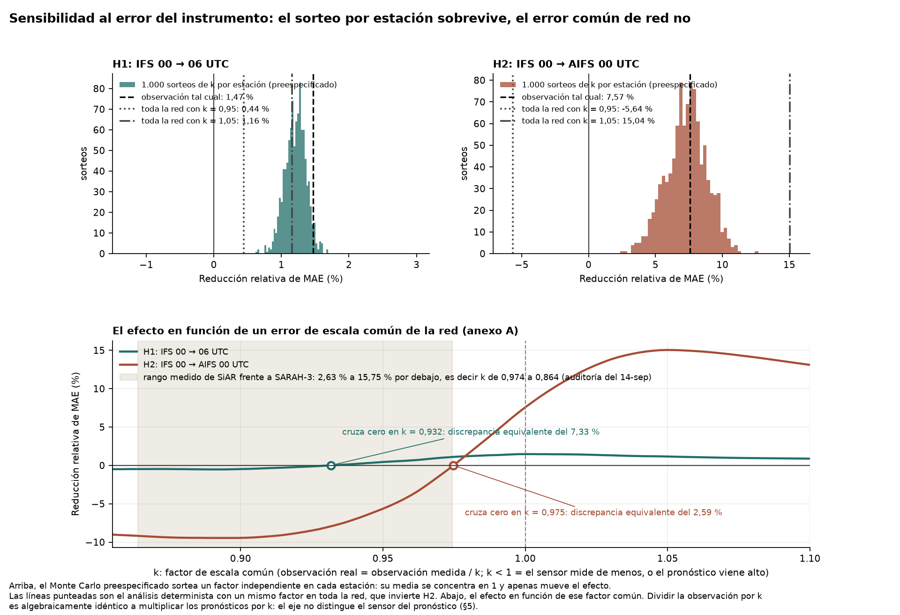

# Medición a escala: valor de la actualización (IFS 00→06 UTC) e IA frente a física (AIFS vs IFS)

Informe generado el 2026-09-19T08:03:56 UTC · radiación global diaria · observaciones SiAR · pronósticos ECMWF servidos por Open-Meteo (Single Runs API)

Cálculo de `resultados.json`: 2026-09-16T18:39:34 UTC; ninguna cifra preespecificada ha cambiado desde entonces. Posteriores a ese cálculo, y por tanto escritos sabiendo ya el resultado: el anexo A entero (2026-09-19); la redacción del titular de §1; el párrafo sobre el alcance del Monte Carlo de §5; la tabla de pasadas ausentes de §3; las desviaciones declaradas de §2; las viñetas de §7 sobre las magnitudes medidas de la discrepancia, sobre la dispersión del sesgo por estación, sobre la identificación del eje k y la corrección sobre la interpolación horaria; y las dos figuras, que añaden la línea y el panel del análisis determinista. El veredicto de §1 lo produce la regla congelada de sensibilidad, no la redacción.

## 1. Resultado en una frase

**Ninguna de las dos hipótesis primarias sobrevive al análisis de sensibilidad al instrumento preespecificado, aunque las dos superan la corrección de multiplicidad con la observación tal cual; medido en 34 estaciones SiAR y 110 días objetivo de mayo a agosto de 2026, con una sola versión de cada modelo y sin invierno.** Con la observación tal cual, del 14 de mayo al 31 de agosto de 2026: actualizar IFS del ciclo 00 al 06 UTC reduce el MAE un 1,47 % (IC95 con bloques de 7 días [0,69; 2,26], supera Holm) y AIFS mejora a IFS a igual ciclo un 7,57 % ([4,60; 10,48], supera Holm). Las dos fallan de maneras distintas al dividir la observación por un factor de escala común k: con k = 0,95 la actualización cae a 0,44 % y pierde el intervalo [-0,58; 1,39] sin cambiar de signo, mientras que la ventaja de AIFS se invierte a -5,64 % [-10,08; -1,33]. En las mismas unidades que usa la auditoría de referencia de este proyecto, que midió las estaciones SiAR entre un 2,63 % y un 15,75 % por debajo de SARAH-3, la inversión de AIFS empieza en un 2,59 % y la anulación de la actualización en un 7,33 %: el mínimo medido ya roza el primer umbral y tres de las seis estaciones comparadas superan el segundo (cifras del anexo A, posteriores al análisis). Con errores independientes de ±5 % por estación (el Monte Carlo preespecificado) el signo sobrevive en el 100,0 % y el 100,0 % de los 1.000 sorteos, pero ese sorteo promedia 34 factores y no representa un sesgo común de red. Y ese eje no está identificado: dividir la observación por k es algebraicamente idéntico a multiplicar los cuatro pronósticos por k, de modo que estos datos no distinguen un sensor que mide de menos de unos pronósticos que vienen altos.

## 2. Qué se decidió antes de medir

- Especificación congelada: `metodo_fijado.json`, SHA-256 `4f84de4a19ad94283261ac370313cca153177f9b46c77288c0745f18633892e3`, escrita el 2026-09-14T14:41:48.359646 UTC. El primer programa de descarga (observaciones SiAR) arrancó el 2026-09-14T14:41:48.647112 UTC, encadenado en el mismo comando que la congelación; la primera petición de pronósticos fue a las 14:44:50 UTC. Es una marca local y un hash, no un prerregistro externo. Encargo v2 con SHA-256 `9af72f2b98e27eeebca8762b3950d81acd356ddaf601dac5ad0d0695ddc2fd5d`.
- Selección de estaciones por regla: rejilla 1,5°×1,5° (centros de latitud [36.0, 37.5, 39.0, 40.5, 42.0, 43.5] y longitud [-9.0, -7.5, -6.0, -4.5, -3.0, -1.5, 0.0, 1.5, 3.0]), la estación activa más próxima al centro de cada celda con estación (33 celdas), más la primera de Canarias por orden alfabético. Catálogo SiAR del 2026-09-14 07:41 UTC (SHA-256 `c1af4cc4e60fa83bdb9214c243abecd214e21233fc37039f632915c231d99ff6`), 520 estaciones activas, heredado de un trabajo previo del mismo día y anterior a la congelación. Ninguna sustitución tras ver datos; exclusión solo por < 80 % de días válidos en la ventana primaria.
- Hipótesis primarias: H1, reducción de MAE de IFS_00 → IFS_06 > 0; H2, reducción de MAE de IFS_00 → AIFS_00 > 0. Corrección de Holm-Bonferroni (α = 0,05) sobre los dos p bootstrap bilaterales. Secundarias exploratorias: AIFS_00 → AIFS_06, IFS_06 → AIFS_06, la ventana secundaria y la restricción 06-18 UTC.
- Ventanas definidas por la hora de inicialización de las pasadas, no por el día objetivo: el cambio de versión (IFS 50r1 y AIFS Single v2) ocurre en la pasada del 2026-05-12 06 UTC; la primaria son los días objetivo del 14 de mayo al 31 de agosto (110 días, todas las pasadas de la versión nueva) y la secundaria del 3 de abril al 12 de mayo (versión anterior; el archivo de Open-Meteo empieza el 2 de abril de 2026). El 13 de mayo es mixto y se excluye. El encargo escribía 12 de mayo–31 de agosto; se corrigió antes de descargar (C1 de la especificación).
- Bootstrap por días completos (todas las estaciones de cada día remuestreado), bloques circulares de 1, 7 y 14 días, 10.000 réplicas, semilla 20260914. Sensibilidad al instrumento: k ∈ {0,95; 1,00; 1,05} global y 1.000 sorteos de k_i ~ U(0,95; 1,05) por estación, semilla 20260915.
- Métrica: error relativo r = (pronóstico − observación)/media de la observación de la estación; MAE_rel = media de |r|; efecto = (MAE_A − MAE_B)/MAE_A × 100 sobre los mismos estación-días (pares completos por comparación).

**Desviaciones respecto a la especificación congelada, y exposición previa a los datos:**

- *Regla de pasada ausente.* La especificación preveía que una pasada no archivada devolvería HTTP 400 con «model run is not available». El servicio devuelve, para peticiones de varias ubicaciones, HTTP 200 con un cuerpo de texto plano «Unexpected error while streaming data: modelRunUnavailable(...)», que el programa trataba como error transitorio y reintentaba sin fin. El 15 de septiembre a las 12:54 UTC se añadió al clasificador la regla «HTTP 200 con ese texto ⇒ pasada ausente», después de 12 reintentos de la misma pasada. Afecta a la clasificación de 5 peticiones, no a ningún dato descargado. La alternativa de la especificación (descargar por estación tras 12 fallos seguidos) no se ejecutó: esas pasadas no están en el archivo.
- *Exposición previa.* Dos de las 34 estaciones, AL10 y LU01, aparecen en la auditoría de vecinas del 14 de septiembre y sus semihorarios del 16 de junio al 31 de julio ya se habían descargado antes de la congelación; son 92 de los 3.731 estación-días observacionales de la ventana primaria (2,5 %). Las estaciones del piloto y de la réplica anteriores (AL01, C01, M01) no están entre las 34 salvo por la sección 6.5, que las usa explícitamente. La regla de rejilla se fijó y se aplicó sin sustituciones, pero el resultado del piloto (una mejora del orden del 8 % al actualizar el ciclo) era conocido al redactar las hipótesis.
- *Recuento por celda.* El programa de selección aplica «estación activa de huso 30 más próxima al centro», pero no implementa el filtro C5 (excluir nombres con «Invernadero» o «(malla)»). El recuento publicado de estaciones dentro de la celda (39,0, 0,0) es 33 e incluye una estación inelegible; bajo C5 serían 32. La estación seleccionada no cambia en ninguna celda, ni la canaria.
- *Anexo A.* Las métricas alternativas, el LOSO, la curva frente a k y la comparación de sorteos del anexo A no están en la especificación congelada; se calcularon el 2026-09-19, después de ver los resultados, y no entran en las hipótesis ni en Holm.
- *Figuras.* La especificación fija `figura_principal` como «efecto por estación con intervalo L = 7 y el efecto agregado» y `figura_sensibilidad` como «histograma del efecto de H1 y H2 en los 1.000 sorteos». Las dos añaden el análisis determinista: la primera, la línea del agregado con k = 0,95; la segunda, las marcas de k = 0,95 y k = 1,05 y un panel con la curva del efecto frente a k. Son adiciones posteriores al cálculo y no cambian ninguna cifra.

## 3. Muestra

34 estaciones seleccionadas; 0 excluidas por cobertura. Observaciones válidas en la ventana primaria: 3731 estación-días de 3740 posibles. Pronósticos válidos (estación-días) en la primaria: IFS_00 3706, IFS_06 3706, AIFS_00 3706, AIFS_06 3706. Peticiones a la API: 599 correctas de 604.

| Orden | Código | Nombre | Lat | Lon | Alt (m) | Celda | Dist. centro (km) | Piranómetro | Días válidos primaria (de 110) | Días válidos secundaria (de 40) | Excluida |
|---|---|---|---:|---:|---:|---|---:|---|---:|---:|---|
| 0 | CA06 | Vejer de la Frontera | 36,285 | -5,840 | 13 | (36.0, -6.0) | 34,8 | SP1110 | 110 | 40 | no |
| 1 | MA07 | IFAPA Churriana | 36,674 | -4,503 | 17 | (36.0, -4.5) | 74,9 | SP1110 | 110 | 40 | no |
| 2 | AL10 | Adra | 36,747 | -2,992 | 2 | (36.0, -3.0) | 83,0 | SP1110 | 110 | 40 | no |
| 3 | H07 | La Puebla de Guzmán | 37,552 | -7,248 | 248 | (37.5, -7.5) | 22,9 | SP1110 | 110 | 40 | no |
| 4 | SE19 | IFAPA  Centro Las Torres-Tomejil | 37,513 | -5,964 | 12 | (37.5, -6.0) | 3,5 | SP1110 | 110 | 40 | no |
| 5 | CO101 | IFAPA Centro de Cabra | 37,498 | -4,431 | 543 | (37.5, -4.5) | 6,1 | sin dato en la ficha | 101 | 40 | no |
| 6 | J02 | Pozo Alcón | 37,672 | -2,930 | 881 | (37.5, -3.0) | 20,1 | SP1110 | 110 | 40 | no |
| 7 | MU01 | Finca experimental de Aguilas (CIDA) | 37,419 | -1,592 | 30 | (37.5, -1.5) | 12,2 | PYRA 04 | 110 | 40 | no |
| 8 | A101 | Elx EEA | 38,248 | -0,696 | 62 | (37.5, 0.0) | 103,2 | sin dato en la ficha | 110 | 40 | no |
| 9 | BA06 | Olivenza | 38,721 | -7,058 | 202 | (39.0, -7.5) | 49,3 | PYRA 04 | 110 | 40 | no |
| 10 | BA106 | Santa Amalia | 39,013 | -5,985 | 252 | (39.0, -6.0) | 1,9 | sin dato en la ficha | 110 | 40 | no |
| 11 | CR03 | Porzuna | 39,234 | -4,231 | 610 | (39.0, -4.5) | 34,9 | SP1110 | 110 | 40 | no |
| 12 | CR07 | Argamasilla de Alba | 39,076 | -3,058 | 702 | (39.0, -3.0) | 9,8 | SP1110 | 110 | 40 | no |
| 13 | AB09 | Motilleja | 39,165 | -1,770 | 680 | (39.0, -1.5) | 29,6 | SP1110 | 110 | 40 | no |
| 14 | A04 | Ondara | 38,819 | 0,007 | 38 | (39.0, 0.0) | 20,2 | SP1110 | 110 | 40 | no |
| 15 | IB01 | Santa Eulalia | 39,010 | 1,440 | 120 | (39.0, 1.5) | 5,3 | SP1110 | 110 | 40 | no |
| 16 | IB05 | Felanitx | 39,475 | 3,086 | 82 | (39.0, 3.0) | 53,4 | SP1110 | 110 | 40 | no |
| 17 | CC12 | Gargantilla | 40,239 | -5,941 | 591 | (40.5, -6.0) | 29,4 | SP1110 | 110 | 40 | no |
| 18 | M102 | Villa del Prado | 40,251 | -4,273 | 466 | (40.5, -4.5) | 33,7 | SP1110 | 110 | 40 | no |
| 19 | GU03 | Armuña de Tajuña | 40,530 | -3,014 | 738 | (40.5, -3.0) | 3,6 | SP1110 | 110 | 40 | no |
| 20 | TE06 | Villarquemado | 40,526 | -1,290 | 989 | (40.5, -1.5) | 18,0 | SP1110 | 110 | 40 | no |
| 21 | CS03 | San Rafael del Río | 40,594 | 0,368 | 217 | (40.5, 0.0) | 32,8 | SP1110 | 110 | 40 | no |
| 22 | IB06 | Sa Pobla | 39,803 | 3,042 | 4 | (40.5, 3.0) | 77,6 | SP1110 | 110 | 40 | no |
| 23 | LU02 | Monforte de Lemos | 42,507 | -7,502 | 331 | (42.0, -7.5) | 56,4 | SP1110 | 110 | 40 | no |
| 24 | ZA01 | Colinas de Trasmonte | 42,001 | -5,811 | 707 | (42.0, -6.0) | 15,6 | SP1110 | 110 | 40 | no |
| 25 | P02 | Villamuriel de Cerrato | 41,946 | -4,488 | 736 | (42.0, -4.5) | 6,1 | PYRA 04 | 110 | 40 | no |
| 26 | SO03 | Fuentecantos | 41,832 | -2,434 | 1019 | (42.0, -3.0) | 50,4 | PYRA 04 | 110 | 40 | no |
| 27 | NA04 | 25 Ablitas | 41,998 | -1,643 | 341 | (42.0, -1.5) | 11,8 | SP1110 | 110 | 40 | no |
| 28 | HU07 | Barbastro | 42,013 | 0,113 | 410 | (42.0, 0.0) | 9,4 | SP1110 | 110 | 40 | no |
| 29 | LU01 | Castro de Rei | 43,155 | -7,488 | 400 | (43.5, -7.5) | 38,4 | SP1110 | 110 | 40 | no |
| 30 | P104 | Lomilla de Aguilar | 42,759 | -4,295 | 905 | (43.5, -4.5) | 84,1 | sin dato en la ficha | 110 | 40 | no |
| 31 | BU101 | Valle de Losa | 42,967 | -3,236 | 635 | (43.5, -3.0) | 62,3 | sin dato en la ficha | 110 | 39 | no |
| 32 | NA106 | 01 Arazuri | 42,810 | -1,723 | 396 | (43.5, -1.5) | 78,9 | sin dato en la ficha | 110 | 40 | no |
| 33 | TF153 | Adeje - Hoya Grande Aire Libre | 28,143 | -16,780 | 132 | Canarias | — | sin dato en la ficha | 110 | 5 | no |

- Días observacionales no válidos, ventana primaria: CO101: valor vacío o no numérico ×9.
- Días observacionales no válidos, ventana secundaria: BU101: kt < 0,03 ×1; TF153: valor vacío o no numérico ×35.
- Días observacionales no válidos, ventana fuera de las dos ventanas: TF153: valor vacío o no numérico ×2.

Los 3731 estación-días válidos de la primaria son 3.740 menos los no válidos de esa ventana. Los recuentos del catálogo de `estaciones.json` se refieren al rango descargado completo (1 de abril a 1 de septiembre) y por eso son mayores.

**Pasadas que el archivo del proveedor no tiene** (registradas como ausentes, sin sustituir por otro ciclo):

| Pasada | Día objetivo | Serie que falta | Efecto |
|---|---|---|---|
| 2026-05-12T06:00 UTC | 2026-05-13 | IFS_06 | ninguno: el 13 de mayo está excluido de las dos ventanas por mixto |
| 2026-06-11T00:00 UTC | 2026-06-12 | AIFS_00 | los 34 estación-días de ese día quedan sin AIFS_00 |
| 2026-06-11T00:00 UTC | 2026-06-12 | IFS_00 | los 34 estación-días de ese día quedan sin IFS_00 |
| 2026-06-22T06:00 UTC | 2026-06-23 | AIFS_06 | los 33 estación-días de ese día quedan sin AIFS_06 |
| 2026-06-22T06:00 UTC | 2026-06-23 | IFS_06 | los 33 estación-días de ese día quedan sin IFS_06 |

Por eso N difiere entre comparaciones: H1 3664, H2 3697, S1 3664, S2 3698, frente a los 3731 estación-días con observación válida. Cada comparación usa solo los estación-días en que sus dos series existen.

## 4. Resultado primario (ventana primaria, 14 mayo–31 agosto 2026)

Positivo = la segunda serie tiene menor MAE. MAE_rel en % de la observación media de cada estación; contaminado por la escala del instrumento y solo interpretable en la comparación.

| Comparación | N estación-días | MAE_rel A | MAE_rel B | Efecto | IC95 L=1 | IC95 L=7 | IC95 L=14 | p L=1 | p L=7 | p L=14 |
|---|---:|---:|---:|---:|---:|---:|---:|---:|---:|---:|
| H1: IFS_00 → IFS_06 | 3664 | 8,13 % | 8,01 % | 1,47 % | [0,46; 2,50] | [0,69; 2,26] | [0,80; 2,19] | 0,0042 | 0,0006 | < 0,0002 |
| H2: IFS_00 → AIFS_00 | 3697 | 8,15 % | 7,53 % | 7,57 % | [5,33; 9,74] | [4,60; 10,48] | [5,04; 9,94] | < 0,0002 | < 0,0002 | < 0,0002 |

Veredicto tras Holm (α = 0,05), por largo de bloque:

| Largo de bloque | H1 p ajustado | H1 apoyada | H2 p ajustado | H2 apoyada |
|---|---:|---|---:|---|
| 1 día | 0,0042 | sí | < 0,0002 | sí |
| 7 días | 0,0006 | sí | < 0,0002 | sí |
| 14 días | < 0,0002 | sí | < 0,0002 | sí |

## 5. Robustez al instrumento

Esta es la sección que decide el titular. El modelo es observación medida = k × observación real; el análisis divide la observación por k, de modo que k < 1 representa un sensor que mide de menos.

**Qué mide en realidad el eje k, y qué no.** Como el error relativo es |pronóstico − observación/k| dividido por la media de observación/k, el factor sale fuera y la expresión equivale a |k × pronóstico − observación| dividido por la media de la observación. Es decir, dividir la observación por k es *algebraicamente idéntico* a multiplicar los cuatro pronósticos por k: comprobado numéricamente en las cuatro comparaciones y en k ∈ {0,95; 1,00; 1,05}, con diferencia máxima 5.8e-14. Este análisis mide, pues, la sensibilidad a un factor multiplicativo común entre pronóstico y observación, y **no distingue un sensor que mide de menos de unos pronósticos que vienen altos** (por ejemplo, por la desagregación horaria del proveedor). La atribución al instrumento viene de la literatura y de la auditoría de referencia citadas en §7, no de estos datos. Esta comprobación es posterior al cálculo (anexo A).

Determinista (observación de todas las estaciones dividida por k; todo recalculado, incluidas las medias por estación, los intervalos y Holm):

| k | H1 efecto | H1 IC95 L=1 | L=7 | L=14 | H1 apoyada (L=7) | H2 efecto | H2 IC95 L=1 | L=7 | L=14 | H2 apoyada (L=7) |
|---|---:|---:|---:|---:|---|---:|---:|---:|---:|---|
| 0,95 | 0,44 % | [-0,60; 1,50] | [-0,58; 1,39] | [-0,54; 1,36] | no | -5,64 % | [-8,49; -2,90] | [-10,08; -1,33] | [-10,77; -0,64] | no |
| 1,00 | 1,47 % | [0,46; 2,50] | [0,69; 2,26] | [0,80; 2,19] | sí | 7,57 % | [5,33; 9,74] | [4,60; 10,48] | [5,04; 9,94] | sí |
| 1,05 | 1,16 % | [0,33; 2,00] | [0,36; 1,92] | [0,40; 1,93] | sí | 15,04 % | [13,12; 16,94] | [11,39; 18,55] | [10,76; 19,35] | sí |

Veredicto determinista: H1: NO robusto (signo invariante: sí; conclusión de los intervalos invariante: no); H2: NO robusto (signo invariante: no; conclusión de los intervalos invariante: no).

Monte Carlo (1000 sorteos de k_i ~ U(0,95; 1,05) independiente por estación, semilla 20260915):

| Comparación | Efecto medio | Desv. | P2,5 | Mediana | P97,5 | Fracción con signo positivo | Supervivencia nivel 1 (signo) | Nivel 2 (signo e intervalo) L=1 / L=7 / L=14 |
|---|---:|---:|---:|---:|---:|---:|---:|---|
| H1 | 1,21 % | 0,15 | 0,90 | 1,21 | 1,49 | 100,0 % | 100,0 % | 93,8 % / 99,0 % / 99,9 % |
| H2 | 7,31 % | 1,51 | 4,21 | 7,39 | 10,16 | 100,0 % | 100,0 % | 100,0 % / 99,7 % / 99,8 % |
| S1 | 0,39 % | 0,11 | 0,19 | 0,39 | 0,60 | 100,0 % | — | — |
| S2 | 6,33 % | 1,49 | 3,37 | 6,37 | 9,18 | 100,0 % | — | — |

**El Monte Carlo preespecificado no mide lo mismo que el determinista.** El encargo lo llama «el resultado principal de robustez», y bajo él las dos hipótesis sobreviven al 100 %. Pero al sortear k_i independiente en cada una de las 34 estaciones, la media de los 34 factores tiene desviación 0,0049, frente a 0,0288 de un k común sorteado con la misma ley: el Monte Carlo equivale a un error de red de unas décimas de punto, no al ±5 % que su enunciado sugiere. Sorteando en cambio un k común U(0,95; 1,05), el signo de H2 se invierte en el 25,8 % de los sorteos y el de H1 en el 0,0 %. Las fracciones de supervivencia de la tabla miden robustez frente a errores idiosincrásicos de cada estación, no frente a un sesgo común de la red. **Este contraste es posterior al cálculo** (el sorteo de k común se hizo el 2026-09-19, ya conocidos los resultados) y empuja hacia el lado negativo; se declara aquí por simetría con la regla que prohíbe añadir métodos para rescatar un resultado. El veredicto del titular, en cambio, sale del análisis determinista, que sí está preespecificado.

## 6. Secundarias y estratos (exploratorio, sin corrección)

### 6.1 Comparaciones secundarias, ventana primaria

| Comparación | N estación-días | MAE_rel A | MAE_rel B | Efecto | IC95 L=1 | IC95 L=7 | IC95 L=14 | p L=1 | p L=7 | p L=14 |
|---|---:|---:|---:|---:|---:|---:|---:|---:|---:|---:|
| S1: AIFS_00 → AIFS_06 | 3664 | 7,53 % | 7,50 % | 0,39 % | [-0,27; 1,10] | [-0,24; 1,01] | [-0,28; 1,03] | 0,2702 | 0,2176 | 0,2542 |
| S2: IFS_06 → AIFS_06 | 3698 | 7,99 % | 7,48 % | 6,34 % | [4,15; 8,55] | [3,47; 9,09] | [3,97; 8,51] | < 0,0002 | < 0,0002 | < 0,0002 |

### 6.2 Ventana secundaria (versión anterior de los modelos)

Días objetivo 2026-04-03 a 2026-05-12 (40 días; inicio ajustado al primer día con las cuatro pasadas archivadas: 2026-04-03). No se mezcla con la primaria.

| Comparación | N estación-días | MAE_rel A | MAE_rel B | Efecto | IC95 L=1 | IC95 L=7 | IC95 L=14 | p L=1 | p L=7 | p L=14 |
|---|---:|---:|---:|---:|---:|---:|---:|---:|---:|---:|
| H1: IFS_00 → IFS_06 | 1324 | 13,80 % | 13,44 % | 2,60 % | [-0,50; 5,67] | [-1,46; 5,29] | [-1,41; 5,11] | 0,0986 | 0,1808 | 0,2090 |
| H2: IFS_00 → AIFS_00 | 1324 | 13,80 % | 12,11 % | 12,24 % | [8,32; 15,66] | [7,96; 15,65] | [6,99; 15,59] | < 0,0002 | < 0,0002 | < 0,0002 |
| S1: AIFS_00 → AIFS_06 | 1324 | 12,11 % | 12,03 % | 0,61 % | [-0,69; 1,84] | [-0,56; 1,57] | [-0,54; 1,44] | 0,3362 | 0,2846 | 0,2884 |
| S2: IFS_06 → AIFS_06 | 1324 | 13,44 % | 12,03 % | 10,45 % | [6,50; 14,05] | [6,61; 13,77] | [6,68; 12,97] | < 0,0002 | < 0,0002 | < 0,0002 |

### 6.3 Estratos de la ventana primaria (efecto puntual e IC95 con bloques de 7 días; los tres largos están en resultados.json)

| Estrato | N (H1) | H1 efecto | H1 IC95 L7 | H2 efecto | H2 IC95 L7 | S1 efecto | S2 efecto |
|---|---:|---:|---:|---:|---:|---:|---:|
| mes_2026-05 | 612 | 0,35 % | [-1,54; 2,81] | 4,93 % | [0,34; 9,72] | -1,12 % | 3,53 % |
| mes_2026-06 | 944 | 1,16 % | [-0,10; 2,45] | 7,61 % | [0,55; 13,68] | 0,72 % | 6,38 % |
| mes_2026-07 | 1054 | 1,31 % | [0,04; 3,01] | 6,81 % | [1,09; 11,81] | 0,28 % | 5,83 % |
| mes_2026-08 | 1054 | 2,54 % | [0,76; 4,29] | 9,76 % | [3,15; 16,61] | 1,06 % | 8,40 % |
| latitud_sur (11 estaciones) | 1180 | 1,87 % | [-0,46; 4,05] | 8,62 % | [4,22; 13,13] | -0,65 % | 5,96 % |
| latitud_centro (11 estaciones) | 1188 | 2,80 % | [0,76; 4,81] | 0,33 % | [-9,72; 8,28] | 1,11 % | -1,92 % |
| latitud_norte (12 estaciones) | 1296 | 0,70 % | [-0,62; 1,97] | 10,17 % | [5,91; 14,58] | 0,58 % | 10,01 % |
| nubosidad_baja (cortes 9,4 / 35,5 %, fuente IFS_00) | 1218 | 2,33 % | [1,16; 3,69] | 2,16 % | [-2,21; 6,90] | 0,37 % | 0,32 % |
| nubosidad_media (cortes 9,4 / 35,5 %, fuente IFS_00) | 1224 | 1,95 % | [0,81; 3,12] | 8,31 % | [3,67; 12,45] | 0,96 % | 7,49 % |
| nubosidad_alta (cortes 9,4 / 35,5 %, fuente IFS_00) | 1222 | 0,86 % | [-0,59; 2,35] | 9,13 % | [5,01; 13,11] | 0,05 % | 8,11 % |

### 6.4 Por estación (ventana primaria; IC95 con bloques de 7 días)

| Estación | N (H1) | Obs. media (Wh/m²) | H1 efecto | H1 IC95 L7 | H2 efecto | H2 IC95 L7 | S1 efecto | S2 efecto |
|---|---:|---:|---:|---:|---:|---:|---:|---:|
| CA06 | 108 | 7.425 | 2,24 % | [-5,52; 9,66] | 7,78 % | [-8,39; 24,15] | -1,74 % | 2,75 % |
| MA07 | 108 | 7.187 | 1,85 % | [-2,79; 6,61] | 11,38 % | [2,01; 20,44] | -1,13 % | 7,99 % |
| AL10 | 108 | 7.141 | 6,42 % | [-1,06; 14,90] | -18,82 % | [-32,60; -6,37] | -1,14 % | -29,09 % |
| H07 | 108 | 7.639 | -4,22 % | [-11,03; 1,80] | -5,10 % | [-17,04; 5,64] | 1,20 % | -1,10 % |
| SE19 | 108 | 7.613 | 0,68 % | [-8,46; 9,86] | 4,74 % | [-2,82; 13,58] | -0,44 % | 3,29 % |
| CO101 | 100 | 7.430 | 4,67 % | [-2,52; 11,90] | 13,18 % | [2,31; 22,75] | 0,78 % | 9,55 % |
| J02 | 108 | 7.619 | 1,85 % | [-4,20; 7,52] | 1,51 % | [-14,06; 13,12] | 2,94 % | 1,72 % |
| MU01 | 108 | 6.757 | 1,28 % | [-2,89; 5,47] | 6,65 % | [-0,70; 14,28] | -1,98 % | 3,56 % |
| A101 | 108 | 7.136 | 0,99 % | [-5,46; 7,97] | 9,85 % | [-0,11; 19,74] | 0,39 % | 9,17 % |
| BA06 | 108 | 7.507 | 4,89 % | [-2,29; 11,31] | 16,69 % | [3,71; 27,12] | -1,93 % | 11,59 % |
| BA106 | 108 | 7.685 | 5,20 % | [-0,86; 10,14] | -4,38 % | [-27,19; 11,69] | 0,42 % | -11,60 % |
| CR03 | 108 | 7.583 | 3,57 % | [-1,67; 8,77] | 13,40 % | [-0,09; 25,04] | 0,42 % | 9,08 % |
| CR07 | 108 | 7.557 | 1,75 % | [-11,67; 12,43] | 7,67 % | [-11,90; 21,70] | 4,73 % | 9,59 % |
| AB09 | 108 | 7.356 | 7,10 % | [2,04; 11,66] | 1,91 % | [-21,86; 17,74] | 4,41 % | -1,14 % |
| A04 | 108 | 6.868 | -2,31 % | [-14,56; 8,14] | -0,63 % | [-20,24; 15,04] | 0,12 % | 1,58 % |
| IB01 | 108 | 6.996 | 4,61 % | [-2,48; 12,13] | 11,75 % | [-1,64; 22,67] | 0,53 % | 8,07 % |
| IB05 | 108 | 7.112 | 4,31 % | [-0,06; 8,13] | -1,52 % | [-24,06; 13,29] | 2,47 % | -3,40 % |
| CC12 | 108 | 7.651 | 4,88 % | [-4,04; 13,28] | -0,32 % | [-15,80; 14,62] | -4,54 % | -13,17 % |
| M102 | 108 | 7.873 | 2,97 % | [-4,15; 9,32] | -43,20 % | [-80,06; -20,02] | 1,04 % | -44,85 % |
| GU03 | 108 | 7.689 | -8,15 % | [-20,32; 1,32] | -11,22 % | [-35,00; 9,00] | -2,39 % | -4,84 % |
| TE06 | 108 | 7.257 | 2,04 % | [-4,84; 9,60] | -7,82 % | [-22,29; 4,30] | -0,03 % | -10,21 % |
| CS03 | 108 | 6.542 | 2,42 % | [-2,86; 6,98] | 13,10 % | [0,15; 26,06] | 3,43 % | 14,11 % |
| IB06 | 108 | 7.081 | -1,46 % | [-8,82; 4,10] | 14,45 % | [-0,65; 24,98] | 1,24 % | 15,88 % |
| LU02 | 108 | 5.345 | 0,14 % | [-2,46; 2,46] | 7,22 % | [-0,81; 15,11] | 0,14 % | 6,96 % |
| ZA01 | 108 | 6.875 | 3,53 % | [-0,91; 8,16] | 4,93 % | [-3,63; 13,97] | 0,79 % | 2,09 % |
| P02 | 108 | 7.204 | -0,25 % | [-5,22; 5,20] | 17,10 % | [6,10; 27,45] | -3,19 % | 14,97 % |
| SO03 | 108 | 7.144 | -3,41 % | [-9,81; 1,72] | 13,00 % | [-3,02; 25,93] | -1,20 % | 14,37 % |
| NA04 | 108 | 7.097 | -0,59 % | [-4,88; 3,72] | -7,62 % | [-27,28; 7,27] | 1,07 % | -5,49 % |
| HU07 | 108 | 7.357 | 7,64 % | [-0,02; 14,50] | 2,13 % | [-17,41; 16,06] | 6,75 % | 1,30 % |
| LU01 | 108 | 5.548 | -0,66 % | [-5,29; 3,70] | 12,50 % | [5,95; 19,04] | -0,09 % | 12,78 % |
| P104 | 108 | 6.880 | 4,54 % | [-1,91; 9,86] | 21,46 % | [4,24; 34,58] | -0,64 % | 17,28 % |
| BU101 | 108 | 6.797 | -3,06 % | [-7,48; 1,35] | 9,52 % | [-6,36; 22,25] | -0,22 % | 12,27 % |
| NA106 | 108 | 6.023 | 2,90 % | [0,51; 5,67] | 17,85 % | [11,20; 25,41] | 2,04 % | 17,03 % |
| TF153 | 108 | 6.951 | 0,97 % | [-3,82; 6,46] | 25,35 % | [14,37; 36,50] | -1,63 % | 23,50 % |

### 6.5 Restricción a 06-18 UTC con semihorarios ya existentes (enlace con el trabajo anterior)

Estaciones AL01, C01, M01, AL10, LU01; días 2026-06-16 a 2026-08-31 dentro de la primaria (68 días de calendario, con el hueco del 1 al 9 de agosto). Días con observación 06-18 válida: {'AL01': 68, 'C01': 68, 'M01': 22, 'AL10': 46, 'LU01': 46}. bootstrap circular sobre los días ordenados atravesando el hueco 1-9 de agosto; aproximación declarada.

| Comparación | N | Efecto | IC95 L=1 | IC95 L=7 | IC95 L=14 | p L=7 |
|---|---:|---:|---:|---:|---:|---:|
| H1 | 246 | 4,28 % | [-0,70; 9,06] | [-0,39; 8,40] | [-0,11; 8,49] | 0,0658 |
| H2 | 250 | 6,49 % | [-1,57; 14,29] | [-0,55; 13,47] | [-1,22; 13,85] | 0,0672 |
| S1 | 246 | 1,24 % | [-1,45; 3,79] | [-1,70; 4,58] | [-1,58; 4,66] | 0,4542 |
| S2 | 246 | 2,86 % | [-6,35; 11,30] | [-5,08; 11,06] | [-4,90; 10,39] | 0,5074 |

Por estación (H1, L=7): AL01: 3,46 % [-7,70; 14,09] (N=67); C01: 8,58 % [3,65; 12,48] (N=67); M01: -12,40 % [-31,35; 1,29] (N=22); AL10: -0,45 % [-10,27; 12,03] (N=45); LU01: 1,88 % [-4,62; 9,11] (N=45).

### 6.6 Contexto: MAE y sesgo por serie (NO son resultado; el encargo prohíbe medir el sesgo absoluto del modelo)

La decisión D2 del encargo prohíbe medir el sesgo absoluto del modelo, precisamente porque contra estos sensores no es identificable. Se listan aquí, y se usan en §7 y en el anexo A, con un solo fin: explicar por qué un error de escala común a la red no se cancela en la comparación. No son un resultado ni respaldan ninguna afirmación sobre la calidad de un modelo.

| Serie | N | MAE (Wh/m²) | MAE relativo | Sesgo (Wh/m²) | Sesgo relativo |
|---|---:|---:|---:|---:|---:|
| IFS_00 | 3697 | 551 | 7,75 % | 368 | 5,17 % |
| IFS_06 | 3698 | 539 | 7,58 % | 354 | 4,97 % |
| AIFS_00 | 3697 | 511 | 7,19 % | 228 | 3,21 % |
| AIFS_06 | 3698 | 508 | 7,14 % | 227 | 3,20 % |

## 7. Limitaciones

- Ventana corta y sin invierno: 110 días de mayo a agosto de 2026 con una sola versión; la ventana secundaria (versión anterior, 40 días de primavera) se reporta aparte y no se mezcla. Nada aquí habla de otoño ni invierno.
- El error del sensor se acepta como dato: no se valida ningún piranómetro (D1). Por eso solo se interpretan comparaciones relativas; MAE y sesgo por serie se listan como contexto y no son resultado.
- Un error de escala COMÚN a toda la red no se cancela en la comparación cuando las dos series tienen sesgos distintos: aquí los sesgos relativos son 5,17 % (IFS_00), 4,97 % (IFS_06), 3,21 % (AIFS_00) y 3,20 % (AIFS_06), del mismo orden que la incertidumbre del sensor. Con k = 0,95 los sesgos de IFS se anulan y los de AIFS pasan a negativos, y por eso H2 se invierte.
- **Magnitud documentada del problema, y qué umbral cruza.** Urraca et al. 2019 (*Sensors* 19:2483) miden en los fotodiodos SKYE SP1110 de SiAR una incertidumbre real de ±15 % en irradiación diaria frente a patrones AEMET. La auditoría de referencia de este mismo proyecto (14 de septiembre, 565 días) midió las estaciones SiAR por debajo de SARAH-3: Adra +2,63 %, Almería +2,87 %, La Mojonera +4,85 %, A Capela +6,95 %, Boimorto +8,62 % y Castro de Rei +15,75 %, mientras que las dos de MeteoGalicia quedaban en +1,38 % y −1,96 %; contra LSA SAF las tres SiAR daban +11,21 %, +13,70 % y +20,52 %. Esas cifras son la diferencia relativa al valor medido, la misma base en la que la inversión de AIFS empieza en un 2,59 % y la anulación de la actualización en un 7,33 %. Con ese contraste: las seis estaciones medidas superan el umbral de AIFS, la menor de ellas por un margen muy estrecho (2,63 % frente a 2,59 %); y tres de las seis superan el de la actualización. **Dos advertencias que van con la cifra:** la propia auditoría dice que el satélite no es un patrón y que altitud, relieve y tamaño de píxel explican parte de la diferencia, y esas seis estaciones no son las 34 de este estudio (solo AL10 y LU01 coinciden). Por D1 y D4 no se investiga aquí cuánto vale k; lo que el rango medido impide es tratar k = 0,95 como un caso extremo.
- **La ley del Monte Carlo no describe esta red.** El sesgo relativo por estación de IFS_00 tiene media 5,61 % y desviación 6,42 %, con extremos de -4,69 % en BU101 a 30,98 % en LU02; AIFS_00 muestra la misma dispersión (6,19 %). Un sesgo de estación común a los dos modelos es, por construcción, del lado de la observación, y su dispersión supera con holgura el ±5 % que sortea el Monte Carlo preespecificado.
- **Interpolación temporal, distinta entre modelos.** Open-Meteo interpola a resolución horaria una salida nativa de 3 horas en IFS y de 6 horas en AIFS. Para H1 y S1, que comparan dos series del mismo modelo, la interpolación es idéntica en ambas y se cancela. Para H2 y S2, que comparan modelos distintos, no lo es: si la desagregación de 6 h a 1 h de AIFS no conserva el total diario, produce un desplazamiento sistemático de ese total que no se distingue de «menos sesgo». No se ha cuantificado, porque el archivo conservado no contiene los campos nativos.
- La celda usada es la de 0,25° más próxima (`cell_selection=nearest`), que en costa puede ser marina; es la misma para las dos series de cada comparación, pero la representatividad punto-celda no se corrige.
- La hora de inicialización no es la hora de disponibilidad: este encargo no mide latencia de publicación ni valor económico.
- La red SiAR no cubre la cornisa cantábrica, País Vasco, La Rioja ni Cataluña; el mapa queda sesgado al sur, centro y este. Canarias entra con una sola estación.
- Estratos, secundarias, el enlace 06-18 UTC y el anexo A son exploratorios, sin corrección por multiplicidad; el enlace usa cinco estaciones y un calendario con hueco.
- Bloques de 1, 7 y 14 días con 110 días: la dependencia temporal se aproxima, no se estima; se reportan los tres largos sin elegir.
- Cinco pasadas no están en el archivo del proveedor (tabla de la sección 3); ningún ciclo se sustituye por otro y por eso N difiere entre comparaciones.
- Por D4 no se investigan: la calibración de estaciones concretas, la causa de los días inválidos, la diferencia entre productos de referencia, ni la física de los errores.

## 8. Reproducción

- `metodo_fijado.json` SHA-256 `4f84de4a19ad94283261ac370313cca153177f9b46c77288c0745f18633892e3`; `resultados.json` y `estaciones.json` los generan `code/analizar.py` y `code/preparar_observaciones.py` desde los recibos de `raw/`.
- `datos_y_analisis.zip` contiene el código, las respuestas íntegras con sus recibos SHA-256, las observaciones, los pronósticos, los datos heredados con procedencia y `manifest_sha256.json` con el hash de cada fichero. Lo construye `code/empaquetar.py`, que al terminar escribe en `integridad_paquete.json` el número de ficheros, el tamaño y el SHA-256 del propio zip; ese hash no puede figurar aquí porque el informe va dentro del paquete. `verificar.py` comprueba que el zip existe y que cada entrada coincide con su manifiesto.
- Sin conexión, desde `code/` y en este orden: `python test_metodo.py` (pruebas del método), `python analizar.py` (reproduce `resultados.json` y `panel_analisis.json`), `python diagnostico_posterior.py` (reproduce el anexo A), `python informe.py` (reproduce este informe) y `python verificar.py` (recálculo con aritmética decimal, integridad de recibos y comprobación del paquete). El resultado está en `verificacion.json`. Aviso: `analizar.py`, `informe.py` y los demás **sobrescriben las salidas oficiales** si se ejecutan sobre el árbol entregado; use `--out` o trabaje sobre una copia. Al reproducir desde un paquete extraído, la comprobación del paquete sale como NO APLICA, porque el zip no puede viajar dentro de sí mismo.
- Los recibos de `raw/heredado/` son del 13 de septiembre porque son datos de los trabajos previos; el manifiesto que documenta su copia es del 14 a las 14:52 UTC, posterior a la congelación. Se usan solo en la sección 6.5.
- Gasto contratado en datos y servicios durante todo el encargo: 0 €. No se han comprado datos ni usado claves de pago.

## Anexo A. Diagnóstico posterior (no preespecificado, no es resultado)

Calculado el 2026-09-19T08:03:53 UTC, después de ver los resultados, para interpretar la sensibilidad al instrumento de la sección 5. No entra en las hipótesis, no se corrige por multiplicidad y no cambia ningún veredicto. Los intervalos usan el mismo bootstrap por días completos, semilla y largos de bloque que el análisis principal (10.000 réplicas; 2.000 para la mediana).

**A.1 El mismo efecto medido de otras maneras** (efecto, IC95 con bloques de 7 días y p bilateral):

| Comparación | MAE relativo (oficial) | MAE absoluto | RMSE | Mediana del error absoluto | MAE relativo con el sesgo de cada serie restado por estación |
|---|---|---|---|---|---|
| H1 | 1,47 % [0,69; 2,26] p=0,0006 | 1,54 % [0,77; 2,32] p=< 0,0002 | 1,15 % [0,16; 2,16] p=0,0262 | 1,47 % [-1,43; 4,82] p=0,3300 | 0,79 % [-0,96; 2,54] p=0,3720 |
| H2 | 7,57 % [4,60; 10,48] p=< 0,0002 | 7,18 % [4,20; 10,04] p=< 0,0002 | 7,79 % [4,48; 11,05] p=< 0,0002 | 1,17 % [-5,48; 7,48] p=0,8360 | 0,63 % [-2,96; 4,18] p=0,7608 |
| S1 | 0,39 % [-0,24; 1,01] p=0,2176 | 0,39 % [-0,21; 0,98] p=0,1944 | 0,49 % [-0,17; 1,15] p=0,1504 | 1,72 % [-1,22; 4,33] p=0,2410 | 0,85 % [0,21; 1,46] p=0,0108 |
| S2 | 6,34 % [3,47; 9,09] p=< 0,0002 | 5,86 % [2,97; 8,63] p=< 0,0002 | 6,97 % [3,93; 10,04] p=< 0,0002 | 0,51 % [-7,17; 6,99] p=0,9520 | 0,48 % [-2,99; 3,72] p=0,8026 |

- **La parte del efecto que el instrumento no puede mover no se distingue de cero, en las dos hipótesis.** Restando a cada serie su sesgo medio por estación queda solo la dispersión, que es casi idéntica en las cuatro series (IFS_00 437 Wh/m², IFS_06 430 Wh/m², AIFS_00 434 Wh/m², AIFS_06 428 Wh/m²). Con ese error, H2 queda en 0,63 % [-2,96; 4,18] con p = 0,7608, y H1 en 0,79 % [-0,96; 2,54] con p = 0,3720. En términos de error cuadrático, pasar de IFS_00 a AIFS_00 reduce la parte de sesgo un 62 % y la varianza solo un 3,2 %.
- Con la mediana del error absoluto, insensible a la cola de la distribución, H2 queda en 1,17 % [-5,48; 7,48] y H1 en 1,47 % [-1,43; 4,82].

**A.2 El efecto en función de un factor de escala común k** (k < 1 = el sensor mide de menos):

Positivo = la segunda serie es mejor. La penúltima columna traduce el k de cruce a la misma base que usa la auditoría de referencia, es decir la diferencia relativa al valor medido: d = 1/k − 1.

| Comparación | k = 0,90 | k = 0,95 | k = 1,00 | k = 1,05 | k = 1,10 | k en que cruza cero | Discrepancia equivalente que anula el efecto | Sorteos con signo contrario, k común | Ídem, k independiente |
|---|---:|---:|---:|---:|---:|---:|---|---:|---:|
| H1 | -0,48 % | 0,44 % | 1,47 % | 1,16 % | 0,88 % | 0,9317 | 7,33 % de menos | 0,0 % | 0,0 % |
| H2 | -9,45 % | -5,64 % | 7,57 % | 15,04 % | 13,10 % | 0,9748 | 2,59 % de menos | 25,8 % | 0,0 % |
| S1 | 0,42 % | 0,65 % | 0,39 % | -0,02 % | -0,20 % | 1,0482 | 4,60 % de más | 2,2 % | 0,1 % |
| S2 | -8,54 % | -5,57 % | 6,34 % | 13,90 % | 12,06 % | 0,9775 | 2,30 % de menos | 28,2 % | 0,0 % |

- **A.3 Estabilidad de H1.** Según la métrica, el efecto va de 0,79 % (sin_sesgo_rel) a 1,54 % (mae_abs), sobre las cinco de A.1. Quitando una estación cualquiera, 1,34 % a 1,65 %; con peso igual por estación, 1,74 % y 9 de 34 estaciones negativas. Por meses: 2026-05 0,35 % · 2026-06 1,16 % · 2026-07 1,31 % · 2026-08 2,54 %. Sin agosto queda en 1,05 %. Frente al factor de escala común, el efecto no cambia de signo dentro de la banda ±5 % y su máximo cae en k = 1,0000, con la rejilla de 0,0025 usada aquí.
- **A.4 Estabilidad de H2.** Según la métrica, el efecto va de 0,63 % (sin_sesgo_rel) a 7,79 % (rmse), sobre las cinco de A.1. Quitando una estación cualquiera, 6,72 % a 8,40 %; con peso igual por estación, 4,84 % y 10 de 34 estaciones negativas. Por meses: 2026-05 4,93 % · 2026-06 7,61 % · 2026-07 6,81 % · 2026-08 9,76 %. Frente al factor de escala común, el efecto cambia de signo dentro de la banda ±5 % y su máximo cae en k = 1,0500, con la rejilla de 0,0025 usada aquí.
- **A.5 Redundancia espacial.** Los errores diarios brutos de IFS_00 entre estaciones distintas correlacionan 0,108 de media, unas 7,5 estaciones efectivas de 34. Pero el estadístico que se compara no es el error bruto sino la diferencia de errores absolutos entre las dos series, mucho menos correlacionada: -0,000 en H1 y 0,028 en H2, lo que da 34,0 y 17,6 estaciones efectivas. La cifra se acota en 34: con correlación media nula o negativa la fórmula devuelve más de 34, y eso no significa más información que estaciones hay. El bootstrap por días completos ya respeta la dependencia sinóptica; el número de estaciones no debe leerse como 34 réplicas independientes.
- **A.6 Límites de este anexo.** La columna "sin sesgo" resta a cada serie su sesgo medio por estacion estimado sobre la muestra completa; sus intervalos no propagan la incertidumbre de esos 34 sesgos estimados, de modo que son optimistas por construccion. Los intervalos de la mediana usan 2000 réplicas en vez de 10000 por coste de memoria. El k de cruce se interpola linealmente sobre una rejilla de 0,0025. Y por lo dicho en §5, el eje k no separa el instrumento del pronóstico.

*Posible continuación, no ejecutada:* repetir la misma medición cuando el archivo cubra otoño e invierno de la misma versión de modelo.
