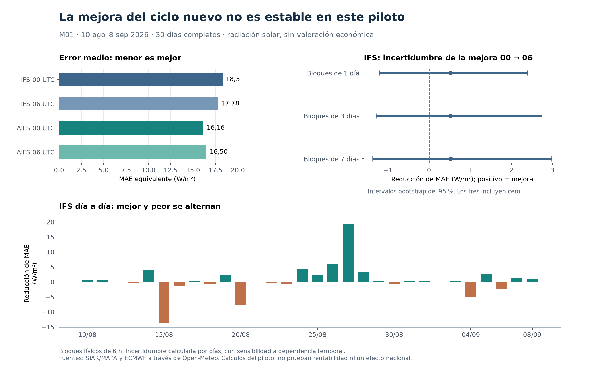

# Resultado del piloto: el ciclo nuevo no ofrece una mejora estable

13 de septiembre de 2026. Estación M01, Center: Finca experimental. Periodo: 10 de agosto–8 de septiembre de 2026.

**La comparación de los treinta días está terminada. No confirma una ventaja estable por acceder al ciclo nuevo.** IFS 06 reduce el error medio un 2,86 % frente a IFS 00, pero el signo cambia entre las dos mitades del mes y todos los intervalos de incertidumbre de esa comparación incluyen cero. En AIFS, pasar de 00 a 06 aumenta el error medio un 2,10 %.

**Decisión: no escalar a monetización ni comprometer cinco meses con esta evidencia.** El resultado principal es inconcluso, no una demostración de que la latencia carezca de valor. Como máximo, el protocolo permite una única réplica declarada en otras estaciones antes de cerrar la cuestión; no se ha ejecutado esa ampliación.

## Qué se comparó

Se mantuvo el protocolo local que habíamos fijado antes de recuperar la muestra: una estación, treinta días, cuatro pronósticos por fecha y bloques físicos de seis horas. Cada predicción procede del ciclo 00 o 06 UTC **del día anterior** a la fecha evaluada. Se utilizaron las mismas observaciones e intervalos para las cuatro alternativas.

Se recuperaron **120 pronósticos**, **1.440 observaciones de media hora** y **30 totales diarios**. Los controles permitieron conservar los **120 bloques previstos**, sin excluir ninguno. No se movieron fechas, se sustituyeron estaciones, se optimizaron desfases ni se rellenaron huecos con ceros. El protocolo original mantiene su hash: `200fb3f7f856f688a15e92818c4b910be9c0cf2497bcc4b78cd7907a3b8dad33`. No es un prerregistro público.

El error principal es la diferencia absoluta de energía por superficie en un bloque de seis horas. Las observaciones de media hora se multiplican por 0,5 horas y se suman; las predicciones horarias se multiplican por una hora y se suman. Dividir el error de bloque por seis permite expresarlo como error medio equivalente de radiación en W/m². **No es error de generación de una planta ni dinero.** La radiación de la API es una media de la hora anterior. [Documentación de Single Runs API](https://open-meteo.com/en/docs/single-runs-api).

## Resultado principal

Menor error absoluto es mejor. Un sesgo positivo significa que el pronóstico sobreestima la radiación de la estación en promedio.

| Pronóstico | MAE por bloque de 6 h, Wh/m² | MAE equivalente, W/m² | Sesgo equivalente, W/m² |
|---|---:|---:|---:|
| IFS 00 UTC | 109,83 | 18,31 | 10,04 |
| IFS 06 UTC | 106,69 | 17,78 | 10,54 |
| AIFS 00 UTC | 96,95 | 16,16 | 2,14 |
| AIFS 06 UTC | 98,99 | 16,50 | 2,42 |

Para **IFS**, disponer del ciclo 06 en vez del 00 reduce el MAE de 109,83 a 106,69 Wh/m² por bloque: **3,14 Wh/m²**, equivalentes a **0,52 W/m²**, o **2,86 %**. Mejora en 17 días, empeora en 11 y empata en dos.

La media del mes esconde una inestabilidad importante:

| Comparación | 10–24 de agosto | 25 de agosto–8 de septiembre |
|---|---:|---:|
| IFS 06 frente a IFS 00 | Error **4,28 % mayor** | Error **12,38 % menor** |
| AIFS 06 frente a AIFS 00 | Error **2,14 % mayor** | Error **2,02 % mayor** |

El resultado secundario de AIFS no respalda que un ciclo más reciente sea automáticamente mejor. Tampoco basta para afirmar que siempre sea peor.

## Incertidumbre: no tratar 120 bloques como 120 días independientes

Se hicieron 10.000 remuestreos de días completos, con semilla fijada, y sensibilidad a bloques consecutivos de uno, tres y siete días. Se usan intervalos percentiles del 95 %. Con treinta días su calibración es limitada; no sustituyen una réplica en otra estación o temporada.

En la tabla siguiente, una cifra positiva indica una **reducción del error** del candidato respecto a su referencia. Las tres últimas columnas muestran límites inferior / superior del intervalo, en W/m² equivalentes.

| Comparación | Mejora media | Bloques de 1 día | Bloques de 3 días | Bloques de 7 días |
|---|---:|---:|---:|---:|
| IFS: 00 → 06 | 0,52 | -1,20 / 2,39 | -1,28 / 2,74 | -1,37 / 2,98 |
| AIFS: 00 → 06 | -0,34 | -0,86 / 0,15 | -0,74 / 0,05 | -0,59 / -0,07 |
| IFS → AIFS, mismo ciclo 00 | 2,15 | -0,69 / 5,39 | -0,94 / 5,76 | -0,82 / 5,41 |
| IFS → AIFS, mismo ciclo 06 | 1,28 | -0,72 / 3,39 | -0,96 / 3,51 | -0,74 / 3,04 |

Para el resultado principal de IFS, los tres intervalos incluyen tanto empeoramiento como mejora. Con bloques de siete días, el intervalo va aproximadamente de **−1,37 a +2,98 W/m²**, frente a una mejora puntual de +0,52 W/m².

Las comparaciones entre modelos son secundarias y exploratorias, sin corrección por comparaciones múltiples. AIFS obtiene menor MAE medio que IFS a igual ciclo —11,72 % menos en 00 y 7,22 % menos en 06—, pero sus intervalos también incluyen cero. En la actualización de AIFS, el intervalo de siete días excluye cero en sentido desfavorable, mientras los de uno y tres días lo incluyen. No se ha escogido el remuestreo más conveniente.

## No confundir precisión, renovación del pronóstico y latencia

Este experimento mide el cambio al seleccionar un ciclo más reciente y la diferencia entre modelos a igual inicialización. No es un experimento causal de velocidad de cómputo. Para valorar un cierre de mercado falta conocer qué contenido podía descargarse y decodificarse realmente antes de ese cierre, por un canal especificado.

La auditoría anterior mostró que el resultado de disponibilidad cambia entre Open-Meteo y el acceso directo a ECMWF. Ese problema no desaparece porque un ciclo nuevo tenga menor error en algunos días. La lectura retrospectiva de un campo tampoco acredita su primera disponibilidad histórica.

La evaluación usa días UTC para comparar radiación. Una valoración posterior del mercado español tendría que volver al calendario de entrega de Europe/Madrid, al perfil de una instalación, a su decisión y a sus costes. No se usaron precios, posiciones ni datos privados de generación.

## Controles realizados

- **Identidad y ubicación:** el catálogo público actual confirma M01 activa y las coordenadas UTM 457867, 4473610, huso 30, iguales a las de la ficha del manual. Se utilizó la celda de pronóstico 40,5° N, 3,5° O, a unos 9,8 km de las coordenadas de estación documentadas. Esta diferencia espacial sigue siendo una limitación. [Catálogo SiAR](https://servicio.mapa.gob.es/siarweb/fichaEstacion/masInfo/coordenadasEstacion).
- **Reloj:** se aplicó la hora UTC mostrada, con cada registro como final de la media hora anterior. Los campos originales se conservaron. Aparecen treinta discrepancias de presentación conocidas en medianoche, todas normalizadas una sola vez. [Manual SiAR](https://servicio.mapa.gob.es/siarweb/documentos/manuales/ManualUsoWebSiAR.pdf), [formato de registro](https://servicio.mapa.gob.es/siarweb/documentos/masInfo/Formato-de-Registro.pdf).
- **Integral diaria:** los treinta días pasan la tolerancia de 0,05 MJ/m² fijada antes de ver la muestra. La mayor discrepancia fue **0,012124 MJ/m²**. Son dos productos del mismo sistema, no mediciones independientes. El campo no documentado `tieneDatos` aparece falso en los totales diarios pese a mostrar valores numéricos; estos coinciden con la tabla pública y la integral. Se conserva esa circunstancia y no se usa el campo como certificado de calidad.
- **Datos ausentes y límites físicos:** ningún bloque excluido; ningún valor fuera de los límites declarados ni contradicción nocturna bajo la comprobación solar especificada. Esto no certifica la calibración del sensor ni descarta suciedad o deriva.
- **Canales y unidades:** diez mensajes originales decodificados, con ocho comparaciones de energía en un día externo a la muestra. Ninguna supera los umbrales diagnósticos fijados. La mayor diferencia absoluta entre campo original y API es **3,31 W/m²** en un intervalo; no es una cota de error del mes completo. Quedan pequeñas diferencias de procesamiento sin atribución exacta, relevantes al interpretar efectos pequeños.
- **Reproducción:** 128 recibos de descarga verificados por hash, cuatro pruebas de cálculo superadas y una segunda agregación independiente desde las series originales usando aritmética decimal. Las cuatro medias de error y los cuatro sesgos coinciden.

Los criterios numéricos adicionales —tolerancia diaria, límites físicos, semilla y remuestreo— se guardaron antes de inspeccionar errores de la muestra. Son reglas de implementación del piloto, no umbrales de rentabilidad.

## Desglose descriptivo por hora

Para que las horas de radiación muy baja no oculten el comportamiento diurno, se muestran todos los bloques, sin seleccionar el más favorable. El resultado principal conserva las cuatro franjas.

| Bloque | IFS 00 | IFS 06 | AIFS 00 | AIFS 06 |
|---|---:|---:|---:|---:|
| 00–06 UTC | 0,32 | 0,33 | 0,48 | 0,47 |
| 06–12 UTC | 35,28 | 34,48 | 21,68 | 23,26 |
| 12–18 UTC | 35,37 | 34,12 | 39,08 | 39,03 |
| 18–24 UTC | 2,25 | 2,20 | 3,40 | 3,23 |

Cifras: MAE equivalente, W/m². Los bloques 00–06 y 18–24 no son estrictamente nocturnos durante todo el periodo.

## Qué decisión tomaría

**No financiaría ni desarrollaría todavía un producto basado en esta supuesta ventaja de latencia.** La mejora de IFS es pequeña e inestable, y el ciclo nuevo de AIFS no mejora la media. Una estación y un mes no permiten demostrar ausencia general de efecto, ni permiten anunciar una oportunidad explotable.

Si se hace la única réplica permitida por el protocolo, debe fijar antes sus estaciones y fechas, mantener estas métricas y comprobar si el signo y tamaño sobreviven. Si también resulta inconclusa, cerraría esta tesis concreta. No convertiría el mejor resultado secundario en la hipótesis principal después de verlo.

La primera comparación prevista está completada. Gasto contratado acumulado en datos y servicios: **0 €**. No queda ningún proceso de captura de esta fase en marcha.
