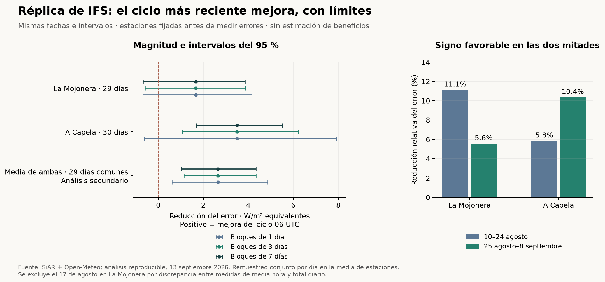

# Réplica final del piloto: una señal favorable, sin ventaja comercial demostrada

13 de septiembre de 2026 · datos contratados: 0 € · dos estaciones nuevas, un mismo mes

La réplica mejora la evidencia respecto a Madrid. El ciclo 06 UTC de IFS reduce el error frente al 00 UTC un **8,56 % en La Mojonera** y un **8,27 % en A Capela**, con signo favorable en ambas mitades del mes. Sería incorrecto seguir afirmando que no aparece ninguna señal consistente.

Pero el resultado primario por estación sigue siendo incierto: los tres intervalos de La Mojonera incluyen cero; en A Capela, el intervalo por días individuales incluye cero y los de bloques de 3 y 7 días son positivos. La media de las dos estaciones es favorable con los tres métodos, aunque se declaró como análisis secundario. Eso no convierte automáticamente el resultado primario en una confirmación concluyente.

**Mi recomendación:** conservar este resultado y cerrar el piloto acotado. No comprometer todavía cinco meses a vender latencia meteorológica. La evidencia permite decir que actualizar el pronóstico puede aportar precisión en esta muestra; no identifica una ventaja exclusiva ni demuestra que alguien pueda monetizarla.



## Qué se decidió antes de medir errores

La especificación se guardó a las **2026-09-13T12:14:02.141591+00:00**, antes de iniciar las dos descargas a las 2026-09-13T12:14:13.331192+00:00. Se eligieron dos estaciones activas por contraste geográfico. Ya se conocía el resultado de Madrid: esto es una réplica espacial posterior al piloto, no un estudio elegido sin información previa. La fecha y el hash locales no equivalen a un prerregistro externo.

Se mantuvieron el 10 de agosto–8 de septiembre de 2026; IFS y AIFS de las 00 y 06 UTC del día anterior; cuatro bloques fijos de seis horas UTC por día; error absoluto en energía por m²; las dos mitades cronológicas originales; y los intervalos bootstrap de 1, 3 y 7 días, con 10.000 réplicas y semilla 20260913. Las estaciones no se sustituyeron tras ver sus datos.

| Estación | Coordenadas derivadas (latitud, longitud) | Celda de pronóstico | Días válidos | Bloques de 6 h |
|---|---:|---:|---:|---:|
| La Mojonera (AL01) | 36,787318, -2,704382 | 36.75, -2.75 | 29 | 116 |
| A Capela (C01) | 43,447991, -8,054780 | 43.5, -8.0 | 30 | 120 |

Las coordenadas se transformaron de ETRS89/UTM 30 a geográficas. La celda más cercana se verificó por separado al decodificar los archivos GRIB originales. La posición de una estación y una celda de 0,25° no representan exactamente el mismo territorio; no se aplicaron correcciones ajustadas a los errores. Fuentes: [catálogo oficial SiAR](https://servicio.mapa.gob.es/siarweb/fichaEstacion/masInfo/coordenadasEstacion), [manual SiAR, ejemplo de coordenadas ETRS89](https://servicio.mapa.gob.es/siarweb/documentos/manuales/ManualUsoWebSiAR.pdf), [transformación de coordenadas en pyproj](https://pyproj4.github.io/pyproj/stable/api/transformer.html).

## Resultado primario: IFS 00 → 06 UTC

Positivo significa menor error en el ciclo más reciente. W/m² equivalentes = error en Wh/m² de un bloque de seis horas dividido entre seis. El porcentaje es reducción de MAE, no beneficio económico ni porcentaje de energía producida.

| Estación | MAE 00 (W/m²) | MAE 06 (W/m²) | Mejora (W/m²) | Reducción de MAE | Primera mitad | Segunda mitad |
|---|---:|---:|---:|---:|---:|---:|
| La Mojonera | 19,55 | 17,88 | 1,67 | 8,56 % | 11,11 % | 5,56 % |
| A Capela | 42,23 | 38,73 | 3,49 | 8,27 % | 5,85 % | 10,35 % |

La Mojonera: 15 días mejor y 14 peor; primera mitad de 14 días válidos, segunda de 15. A Capela: 18 días mejor y 12 peor, con 15 días en cada mitad. La mejora media no significa que actualizar gane todos los días.

| Efecto de IFS 00 → 06 | IC 95 %, días individuales | IC 95 %, bloques de 3 días | IC 95 %, bloques de 7 días |
|---|---:|---:|---:|
| La Mojonera | [-0,69; 4,16] | [-0,59; 3,87] | [-0,68; 3,86] |
| A Capela | [-0,63; 7,92] | [1,07; 6,23] | [1,70; 5,51] |
| Media de ambas, secundaria | [0,61; 4,86] | [1,14; 4,34] | [1,03; 4,34] |

Todos los intervalos de la tabla están en W/m² equivalentes. No se elige el intervalo más favorable. Que los bloques largos den intervalos más estrechos en A Capela no los convierte en pruebas superiores: con 30 días, las estimaciones de dependencia temporal son frágiles.

La media secundaria utiliza **29 fechas comunes**, con el mismo peso para cada estación: mejora de **2,65 W/m² (8,77 %)**. Se promedian primero los errores de ambas estaciones cada día y se remuestrean esos días completos conjuntamente. No se tratan 58 observaciones estación-día como 58 días independientes. El 17 de agosto tampoco entra en esta media para A Capela, aunque sí entra en su resultado individual.

La exclusión deja un hueco entre el 16 y el 18 de agosto en La Mojonera y en la media. Conforme a la regla fijada, el remuestreo circular usa los días completos ordenados y atraviesa ese hueco; es una aproximación declarada. Las mitades mantienen las fechas originales. No se imputó el día.

## Comparaciones secundarias y sesgo

Las siguientes comparaciones son exploratorias y no llevan corrección por comparaciones múltiples. Se muestran todas, no solo las favorables.

| Comparación (positivo = mejora del candidato) | La Mojonera: cambio de MAE | A Capela: cambio de MAE | Media común: cambio de MAE |
|---|---:|---:|---:|
| AIFS 00 → 06 | -0,40 % | 6,14 % | 4,09 % |
| IFS → AIFS a las 00 | -5,86 % | 2,91 % | -2,58 % |
| IFS → AIFS a las 06 | -16,24 % | 0,65 % | -7,84 % |

AIFS 00 → 06 mejora en A Capela con los tres intervalos positivos, pero empeora ligeramente en La Mojonera, donde todos incluyen cero. A igual hora de inicialización, ninguna de las comparaciones IFS/AIFS por estación o en la media tiene un intervalo que excluya cero con estos métodos. No hay respaldo aquí para afirmar que la IA sea superior de forma general.

| Estación | Pronóstico | MAE (W/m² equivalentes) | Sesgo firmado (W/m² equivalentes) |
|---|---|---:|---:|
| La Mojonera | IFS 00 | 19,55 | 12,82 |
| La Mojonera | IFS 06 | 17,88 | 9,74 |
| La Mojonera | AIFS 00 | 20,70 | 12,80 |
| La Mojonera | AIFS 06 | 20,78 | 13,30 |
| A Capela | IFS 00 | 42,23 | 23,85 |
| A Capela | IFS 06 | 38,73 | 19,61 |
| A Capela | AIFS 00 | 41,00 | 33,36 |
| A Capela | AIFS 06 | 38,48 | 30,89 |

Sesgo positivo = sobreestimación media. Las métricas por bloque UTC, día y mitad, y todos los intervalos secundarios, se conservan en resultados.json.

## Calidad y trazabilidad

Se obtuvieron los 240 pronósticos previstos, sin fallos, y 2.880 medidas de media hora más 60 totales diarios. Se verificaron 256 recibos de respuestas de la adquisición principal mediante SHA-256. La comparación con los originales añade cuatro respuestas de API y diez mensajes GRIB globales reutilizados.

**Exclusión observacional:** La Mojonera, 17 de agosto. La integración de las 48 medias da 23,10804 MJ/m² y la tabla diaria publica 19,98 MJ/m²: diferencia de 3,12804, superior al límite previo de 0,05. La causa no se ha determinado. Se excluyeron sus cuatro bloques antes de calcular errores. No se cambió el umbral, no se corrigió el dato con un modelo y no se sustituyó la estación.

El resto de días pasa la comparación de integrales. No hay violaciones del rango 0–1500 W/m² ni radiación superior a 50 W/m² con el sol por debajo de −6° en ambos extremos del intervalo. Estos controles detectan errores gruesos; no certifican la calibración de los sensores.

**Relojes:** se usa el horario UTC que documenta SiAR y el final del intervalo de media hora. En cada estación se registran 30 discrepancias de presentación de medianoche entre gráfico y tabla: la fecha del gráfico con 24:00 se normaliza una sola vez. Se conserva el campo serializado que añade +02:00 y no se usa para desplazar la hora. No se buscaron desplazamientos que redujeran errores. Fuentes: [manual SiAR](https://servicio.mapa.gob.es/siarweb/documentos/manuales/ManualUsoWebSiAR.pdf), [formato de registro](https://servicio.mapa.gob.es/siarweb/documentos/masInfo/Formato-de-Registro.pdf), [unidades de los datos publicados](https://servicio.mapa.gob.es/siarweb/documentos/masInfo/Datos-Publicados.pdf).

**Original/API:** se verificaron 16 bloques de seis horas, cuatro por modelo y estación, el 12 de septiembre, fuera de las fechas evaluadas. Diferencia máxima absoluta: 2,70 W/m² en La Mojonera y 4,65 en A Capela. Ninguno supera los disparadores fijados (>5 W/m² o >2 % cuando la media original supera 50 W/m²). Persisten diferencias de procesamiento: no son una cota garantizada para todo el mes y no deben confundirse con el efecto de actualización. Los datos horarios de radiación son medias de la hora anterior según la [documentación Single Runs](https://open-meteo.com/en/docs/single-runs-api).

La comparación de canales comprueba energía e identificación de la celda. Una descarga correcta hoy no acredita cuándo podía usarse ese archivo al publicarse. La hora de inicialización tampoco es la hora de disponibilidad.

El booleano diario tieneDatos se conserva aunque sea false con valores numéricos visibles. Al no tener una definición de calidad documentada, no se convierte en un indicador meteorológico: se contrasta con la tabla y las integrales.

## Qué cambia respecto al piloto y qué sigue faltando

Madrid había dado +2,86 % para IFS, con una mitad negativa y otra positiva. Las nuevas estaciones sí mantienen signo favorable en ambas mitades. Por tanto, queda una señal descriptiva más sólida de valor de actualización; cerrar afirmando «no sirve» sería exagerado.

Sin embargo, la condición favorable de signos era necesaria, no suficiente. La incertidumbre del resultado primario no desaparece, y esta réplica comparte exactamente el mismo mes con Madrid. No hay validación en otra estación del año, ponderación por generación solar española, producción real de plantas, precios de desvíos ni comparación contra la información que usa hoy un comprador.

Además, cambiar de 00 a 06 UTC cambia el pronóstico y la información incorporada. No aísla causalmente el tiempo de cómputo ni una mejora específica por IA. La auditoría anterior también mostró que un aparente retraso podía depender del canal de distribución elegido. La hipótesis comercial de una ventaja temporal exclusiva sigue sin demostrarse.

La decisión práctica es cerrar esta prueba sin seguir buscando estaciones o meses que mejoren el titular. Si se reabre el proyecto, el motivo tendría que ser evidencia nueva sobre una decisión y un comprador concretos: disponer antes que su alternativa actual de datos que reduzcan un coste medible. Ese sería otro protocolo, no una repetición oportunista de esta prueba. No se ha iniciado ni contratado esa fase.

## Reproducción

El paquete contiene las especificaciones y recibos anteriores al análisis; coordenadas y catálogo; observaciones y tablas originales con campos de sesión omitidos; los 240 pronósticos; los diez mensajes GRIB; análisis por estación, agregado y cálculo aritmético independiente; y las ocho pruebas automatizadas. Las métricas y los intervalos se producen con numpy 2.3.5. El cálculo independiente usa Decimal desde las series originales.

Los intervalos son percentiles de remuestreo, sin ajuste por selección previa ni multiplicidad. La regla y las limitaciones se publican junto al resultado; no se pretende establecer una novedad científica.

SHA-256 del alcance de la réplica: `fedb7dd09639ed7c7122671ec769280de3c05a0dcbaf2bad67095fa03215200f`.

La reproducción desde el ZIP se entrega por separado en verificacion_reproduccion.json, con los resultados de integridad, pruebas y recálculo.
