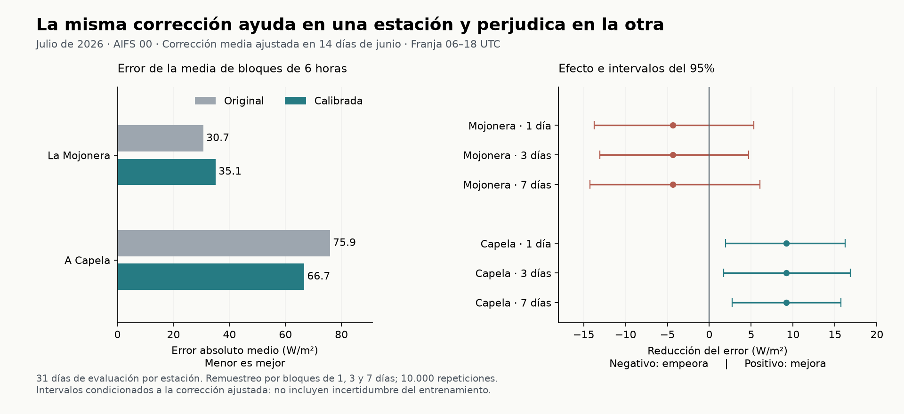

# Validación de la calibración local: decisión tras un mes nuevo

**La corrección media no supera el criterio de mejora general.** En julio reduce el error diurno de AIFS 00 un 12,11% en A Capela y lo aumenta un 14,23% en La Mojonera. La mejora de A Capela aparece en ambas quincenas y sus tres intervalos del 95% excluyen cero. La Mojonera empeora en la primera quincena y mejora en la segunda.

Mi decisión: no dedicaría cinco meses a construir un producto que aplique esta corrección por defecto. Sí dedicaría una prueba breve a investigar si podemos identificar **antes de observar el resultado** cuándo corregir y cuándo conservar la previsión original. El resultado actual apoya investigar diferencias entre lugares y periodos; todavía no demuestra que podamos predecir esas diferencias ni monetizarlas.

## Qué se probó

La especificación se guardó antes de descargar los nuevos valores de junio y julio. Se mantuvieron las dos estaciones anteriores, también aquella donde la calibración había fallado. El diseño se eligió después de examinar agosto–septiembre: es una validación retrospectiva con datos nuevos para este análisis, no un registro externo ni una evaluación operativa en tiempo real. Julio precede al periodo exploratorio anterior, pero dentro de esta prueba el entrenamiento precede estrictamente a la evaluación.

- Entrenamiento fijado: 16–30 de junio de 2026. Quedaron 14 días completos por estación.
- Evaluación: los 31 días del 1–31 de julio de 2026, sin exclusiones.
- Comparación principal: AIFS 00 del día anterior, original frente a una constante de corrección local calculada solamente en junio.
- La constante es el promedio del error firmado de 28 bloques de entrenamiento. Se resta a los bloques 06–12 y 12–18 UTC, con mínimo cero. No cambia durante julio.
- Variable principal: error absoluto medio de la irradiancia media de cada bloque de seis horas entre 06 y 18 UTC. El día completo es secundario.

Los resultados se expresan en W/m² equivalentes: error energético en Wh/m² dividido entre seis horas. **No son errores horarios ni potencia de una planta.** La franja 06–18 UTC tampoco equivale exactamente a las horas de sol.

## Resultado principal

| Estación | MAE original | MAE calibrado | Reducción del MAE | Constante restada |
|---|---:|---:|---:|---:|
| La Mojonera (AL01) | 30,71 W/m² | 35,08 W/m² | -14,23% | 40,13 W/m² |
| A Capela (C01) | 75,94 W/m² | 66,74 W/m² | 12,11% | 30,66 W/m² |

Una reducción negativa significa que la corrección empeora el error.

| Estación | Reducción, 1–15 julio | Reducción, 16–31 julio | Días mejora / empeora / empate |
|---|---:|---:|---:|
| La Mojonera (AL01) | -104,34% | 17,66% | 14 / 15 / 2 |
| A Capela (C01) | 12,92% | 11,59% | 19 / 10 / 2 |

La caída del 104,34% en la primera quincena de La Mojonera significa que el MAE algo más que se duplica, partiendo de un error original pequeño. Es una comparación relativa; no debe confundirse con 104 puntos de irradiancia.

| Estación | Reducción absoluta | IC 95%, bloques de 1 día | IC 95%, 3 días | IC 95%, 7 días |
|---|---:|---:|---:|---:|
| La Mojonera (AL01) | -4,37 W/m² | [-13,76; 5,33] | [-13,04; 4,67] | [-14,23; 6,04] |
| A Capela (C01) | 9,20 W/m² | [1,94; 16,20] | [1,72; 16,85] | [2,75; 15,73] |

Todos los intervalos están en W/m² de reducción. Se remuestrean días emparejados, conservando los bloques diurnos de cada día: 10.000 repeticiones y longitudes circulares de 1, 3 y 7 días. No hay huecos en julio. Los intervalos son condicionales a las constantes entrenadas; no incluyen su incertidumbre de estimación. Un mes contiene pocos grupos de siete días, así que esa sensibilidad tiene límites. No hay corrección por comparaciones múltiples.

El criterio se fijó como una decisión conservadora de continuación: efecto positivo en ambas estaciones, ambas quincenas y los tres intervalos por encima de cero. **Pasa A Capela; falla La Mojonera; falla la afirmación general.** No se utiliza una media entre estaciones para compensarlo.

## Qué revela y qué no

En La Mojonera se restan 40,13 W/m² aprendidos en junio, pero el sesgo firmado de julio es 25,65 W/m² antes de corregir. Tras corregir queda en −14,48 W/m²: el sesgo absoluto disminuye, mientras el MAE aumenta. Es una demostración concreta de por qué reducir el sesgo medio no garantiza mejorar el error absoluto.

En A Capela se restan 30,66 W/m²; el sesgo de julio pasa de 55,32 a 24,65 W/m² y también baja el MAE. La señal favorable persiste aquí, pero una estación no permite atribuirla a toda Galicia ni distinguir por sí sola entre modelo, celda de la rejilla, sensor y características locales.

Este patrón coincide en su dirección con la exploración anterior de agosto–septiembre, que favorecía la corrección media en A Capela y la perjudicaba en La Mojonera. Las cifras de aquel análisis y las de este no se deben comparar como si usaran la misma ventana: allí se destacó el día completo y aquí la franja diurna. Sigue sin ser evidencia de invierno, rentabilidad o novedad científica.

## Todas las variantes previstas

Se muestran las dos formas de estimar la constante y las cuatro series. La mediana es una sensibilidad predefinida; no se elige después el método ganador para reescribir la hipótesis principal.

| Estación | Constante | Serie | MAE diurno original | MAE diurno calibrado | Reducción diurna | Reducción día completo |
|---|---|---|---:|---:|---:|---:|
| La Mojonera (AL01) | Media | IFS 00 | 29,52 | 40,80 | -38,19% | -35,42% |
| La Mojonera (AL01) | Media | IFS 06 | 32,73 | 39,59 | -20,94% | -19,56% |
| La Mojonera (AL01) | Media | AIFS 00 | 30,71 | 35,08 | -14,23% | -12,45% |
| La Mojonera (AL01) | Media | AIFS 06 | 31,29 | 33,74 | -7,83% | -6,86% |
| La Mojonera (AL01) | Mediana | IFS 00 | 29,52 | 34,15 | -15,68% | -14,54% |
| La Mojonera (AL01) | Mediana | IFS 06 | 32,73 | 36,75 | -12,28% | -11,47% |
| La Mojonera (AL01) | Mediana | AIFS 00 | 30,71 | 30,40 | 1,02% | 0,89% |
| La Mojonera (AL01) | Mediana | AIFS 06 | 31,29 | 30,14 | 3,67% | 3,21% |
| A Capela (C01) | Media | IFS 00 | 96,65 | 89,30 | 7,60% | 7,10% |
| A Capela (C01) | Media | IFS 06 | 90,13 | 81,80 | 9,24% | 8,57% |
| A Capela (C01) | Media | AIFS 00 | 75,94 | 66,74 | 12,11% | 11,03% |
| A Capela (C01) | Media | AIFS 06 | 76,84 | 67,95 | 11,56% | 10,56% |
| A Capela (C01) | Mediana | IFS 00 | 96,65 | 87,10 | 9,88% | 9,23% |
| A Capela (C01) | Mediana | IFS 06 | 90,13 | 80,29 | 10,92% | 10,13% |
| A Capela (C01) | Mediana | AIFS 00 | 75,94 | 72,70 | 4,27% | 3,89% |
| A Capela (C01) | Mediana | AIFS 06 | 76,84 | 72,00 | 6,30% | 5,75% |

MAE en W/m² de medias de bloques de seis horas. La mediana obtiene pequeñas mejoras en las series AIFS de La Mojonera; por eso el resultado no equivale a que toda calibración falle allí. Elegirla tras ver esta tabla sería selección retrospectiva. Todos los intervalos y resultados diarios de cada variante están en `resultados.json`.

Para el resultado principal, incluyendo las 24 horas:

| Estación | MAE original | MAE calibrado | Reducción |
|---|---:|---:|---:|
| La Mojonera (AL01) | 17,55 | 19,74 | -12,45% |
| A Capela (C01) | 41,69 | 37,09 | 11,03% |

## Integridad, incidencias y alcance

Se descargaron 4.416 observaciones semihorarias, 92 totales diarios y 364 respuestas de previsiones. El formulario público rechazó la consulta inicial de 46 días por su límite de registros y pidió reducirla. Se consultaron dos tramos contiguos de 23 días, conservando los originales y comprobando que su concatenación era exacta. No cambió la muestra.

El archivo de previsiones respondió que las ejecuciones del 22 de junio a las 06 UTC no estaban disponibles, tanto para IFS como para AIFS. Afectan al día objetivo 23 de junio. Se excluyó ese día entero del entrenamiento de todas las series en ambas estaciones para mantener la muestra emparejada. No se imputó ni se sustituyó otra ejecución. Las cuatro respuestas de error también se conservaron.

Ambas estaciones superaron los controles físicos fijados: 48 semihoras por día, fechas únicas, límites de valores, radiación nocturna y concordancia con el total diario. La discrepancia máxima entre integral y total publicado fue 0,007606 MJ/m² en La Mojonera y 0,006144 en A Capela, frente a una tolerancia de 0,05. Estos controles detectan inconsistencias; no certifican la exactitud del sensor.

Se usó la hora UTC documentada de SiAR y el final de intervalo. Se preservó la discrepancia de presentación de medianoche entre tabla y gráfico; no se buscó un desfase que minimizase el error. El total diario no valida por sí solo el reloj intradiario. Las coordenadas y celdas son las mismas que en la réplica anterior.

La comprobación previa entre campos nativos ECMWF decodificados y API en estas mismas celdas corresponde a septiembre. Se conserva como diagnóstico del procesamiento. **No se descargaron ni verificaron todos los campos nativos históricos de junio y julio.** Las fechas de descarga de este paquete tampoco prueban cuándo habrían estado disponibles las previsiones en tiempo real.

## Cómo seguiría

Haría una única fase adicional de viabilidad, con un límite de dos semanas de trabajo y sin comprar datos:

1. **Precisar la hipótesis:** una decisión basada solamente en observaciones y previsiones anteriores puede decidir cuándo aplicar una corrección local y cuándo abstenerse. No usar como regla que «A Capela funciona» después de haber visto julio.
2. **Diseñar antes de medir:** fijar una sola regla sencilla, sus referencias —original y corrección fija—, las estaciones y una muestra aún no evaluada. Los periodos ya vistos sirven para desarrollar, no para confirmar esa regla. Incluir evaluación cronológica y estaciones que no se hayan utilizado para elegirla.
3. **Exigir un resultado relevante:** mejora fuera de la muestra usada para diseñar y control explícito de cuánto puede perjudicar respecto a conservar el original. La estimación de incertidumbre deberá incluir el reajuste de parámetros. Si depende de escoger estaciones, variantes o fechas después de medir, detener la vía del producto general.

Ese es un experimento distinto y todavía no está ejecutado ni registrado. No lo presento como una manera de rescatar el criterio fallido de esta prueba. Antes de comprometer los cinco meses habría que encontrar además una decisión concreta de un usuario que valore la mejora. No se han estimado euros, contactado a empresas ni programado recogidas recurrentes. Gasto contratado en datos de esta prueba: 0 €.

## Fuentes y reproducción

- [SiAR: manual oficial](https://servicio.mapa.gob.es/siarweb/documentos/manuales/ManualUsoWebSiAR.pdf), [formato de registro](https://servicio.mapa.gob.es/siarweb/documentos/masInfo/Formato-de-Registro.pdf) y [datos publicados](https://servicio.mapa.gob.es/siarweb/documentos/masInfo/Datos-Publicados.pdf): convención horaria, final de intervalo y unidades.
- [Open-Meteo: archivo de ejecuciones individuales](https://open-meteo.com/en/docs/single-runs-api): series utilizadas y significado de la irradiancia horaria. Las URL exactas y respuestas se incluyen en los recibos de cada petición.
- [NOAA: ecuaciones solares](https://gml.noaa.gov/grad/solcalc/solareqns.PDF): aproximación geométrica empleada para el control nocturno.
- La corrección estadística de radiación ya tiene antecedentes, por ejemplo [Bakker et al., 2019](https://arxiv.org/abs/1904.07192). No se atribuye novedad al simple hecho de corregir un pronóstico localmente.

El paquete contiene la especificación, sus huellas, el código congelado antes de calcular errores, parámetros guardados antes de evaluar julio, originales de las consultas, controles y resultados. Se contrastaron 1.136 cantidades con una reconstrucción independiente en aritmética decimal y pasaron seis pruebas del método. La verificación del paquete vuelve a calcular los resultados sin red; el estado y la huella del archivo se entregan en `verificacion.json`.

Especificación SHA-256: `cb946b6747425319d0808534c7ce8423d4b527bc225d3ca9b432aba035f44157`.

El informe refleja una comprobación del 13 de septiembre de 2026. Las huellas y marcas horarias locales documentan el orden de trabajo; no sustituyen un registro externo independiente.
