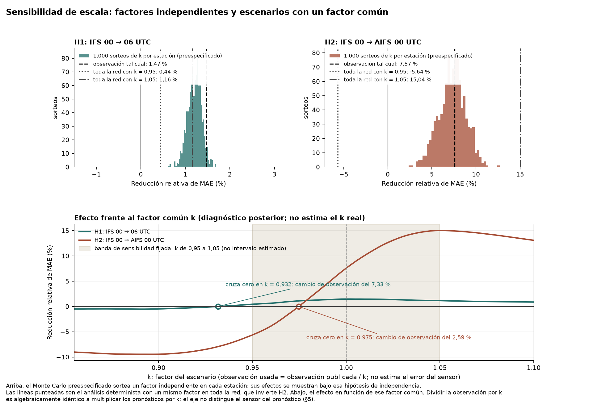

# Revisión de cierre — medición a escala de IFS y AIFS

19 de septiembre de 2026. Continuación del encargo v2 y del informe terminado el 19 de septiembre a las 08:07 UTC. Esta revisión conserva los informes anteriores y no abre una fase experimental.

## Resultado que se puede defender

En **34 estaciones SiAR y 110 días, del 14 de mayo al 31 de agosto de 2026**, actualizar IFS 00→06 UTC y utilizar AIFS en lugar de IFS a las 00 UTC reducen el MAE relativo frente a la observación publicada. Ambas comparaciones superan Holm con los tres largos de bloque. **Las mejoras no superan todos los escenarios de escala preespecificados.** Eso limita la robustez de la conclusión; no demuestra que no haya capacidad predictiva ni identifica un fallo de sensores.

| Comparación | Pares estación-día | Mejora de MAE con SiAR | IC95, bloques de 7 días | Mejora con k = 0,95 | IC95 con k = 0,95 |
|---|---:|---:|---:|---:|---:|
| H1: IFS 00→06 UTC | 3.664 | 1,47 % | [0,69; 2,26] | 0,44 % | [−0,58; 1,39] |
| H2: IFS 00→AIFS 00 UTC | 3.697 | 7,57 % | [4,60; 10,48] | −5,64 % | [−10,08; −1,33] |

Cada comparación conserva las mismas observaciones para sus dos pronósticos. N difiere entre H1 y H2 por las pasadas ausentes, como documenta el informe completo. No se imputan huecos. La tabla recoge el MAE relativo normalizado por la media de cada estación; los porcentajes son reducciones relativas de ese MAE, no puntos porcentuales de irradiación ni mejoras económicas.

El escenario usa O/k. k = 0,95 supone aumentar la observación publicada un 5,263 %: H1 conserva el signo pero pierde un intervalo enteramente positivo, y H2 invierte el signo. No se ha estimado que ese factor sea el verdadero. Con los factores independientes k_i del Monte Carlo, el signo permanece positivo en los 1.000 sorteos de ambas comparaciones; la supervivencia conjunta de signo e intervalo está detallada en el informe completo. Son preguntas de sensibilidad diferentes.

## Correcciones de interpretación

1. **Un residuo compartido por ambos modelos no prueba un error del sensor.** También puede proceder de errores compartidos del modelo o de la representatividad espacial. Incluso con observación perfecta, dos pronósticos iguales a la verdad más una constante tienen un residuo común. La dispersión entre estaciones de esos residuos tampoco identifica la distribución de los errores instrumentales.
2. **Restar el residuo medio no elimina un error de escala.** El residuo centrado es `(F − media(F)) − (O − media(O))/k`. El propio archivo del diagnóstico ya mostraba que el efecto centrado de H2 varía de 0,6988 % a 0,4570 % al pasar de k = 0,95 a 1,05. Lo he recalculado por separado: coincide con el archivo guardado dentro de 2,84 × 10⁻¹⁴. No es una corrección validada fuera de muestra, porque su media se estima sobre todos los días evaluados.
3. **Compartir interpolación no garantiza cancelación en el MAE.** Se evalúa el producto horario servido por Open-Meteo. No se comprueba aquí la conservación de energía frente a campos nativos ni se atribuye al proveedor la diferencia observada.
4. **Las discrepancias anteriores con satélite no son estimaciones de k para estas 34 estaciones.** Se retira de la figura el sombreado que trasladaba ese rango a un factor común. Lo sustituye la banda ±5 % fijada en el método, expresamente como supuesto. La comprobación bibliográfica confirma que [Urraca et al. (2019)](https://doi.org/10.3390/s19112483) citan una comparación anterior SiAR–AEMET para las cifras ±15 % diaria y ±5 % anual; no es una certificación de esta muestra de 2026. Se guarda la respuesta XML pública con URL, fecha y SHA-256.
5. **Las cifras de cruce de k tenían un denominador ambiguo.** Ahora se expresa «aumentar la observación un 2,59 %» para el cruce de H2 y un 7,33 % para H1. No se llama a esos números porcentaje de submedición respecto a una verdad desconocida. Son cálculos posteriores, descriptivos, y no alteran la regla congelada.

Estas correcciones evitan tanto una atribución física injustificada como una conclusión negativa más fuerte que los datos. No se añade ningún método para rescatar o descartar las hipótesis.

## Reproducción y conservación

La copia del ZIP original superaba sus comprobaciones de integridad, pero `code/comun.py` calculaba la carpeta de salida ascendiendo dos niveles y usando una ruta del proyecto. Extraerlo en una carpeta arbitraria no garantizaba que las salidas quedasen dentro de ella. La nueva copia fija `OUT` a su propia carpeta `outputs/` y añade un lanzador que trabaja en una copia de reproducción.

- Reconstrucción completa de observaciones, análisis principal y diagnóstico posterior: **60.602 valores numéricos, diferencia máxima exactamente cero**. Se comparan también estructura, texto y huecos; solo se excluyen tres marcas de generación.
- Se mantienen las **10.000 réplicas bootstrap**, los **1.000 sorteos**, las semillas, las fechas, la selección y los cuatro motores numéricos originales, comprobados por hash. Pasan las **16 pruebas** del método.
- La ejecución bloquea conexiones y procesos externos mediante un audit hook de Python; no hubo intentos. Esto describe el proceso probado, no un cortafuegos del sistema.
- El nuevo lanzador verifica el manifiesto antes de ejecutar y comprueba también el recálculo decimal y los **708 recibos originales**. Su resultado y la integridad final del ZIP se entregan en `verificacion_entrega.json`, entregado junto al ZIP.
- Se conservan el ZIP anterior, los informes, los datos y el código del trabajo previo. `originales_antes.json` y la comprobación final documentan sus hashes. Los cambios de código de presentación y rutas están en `revision/*.diff` dentro del paquete.

La igualdad de la reproducción verifica la implementación y la conservación de los resultados; no valida por sí sola los supuestos físicos o estadísticos.

## Recomendación

**Cerrar esta medición como resultado de investigación reproducible con mejoras condicionadas a SiAR y sensibilidad de escala no resuelta.** Es defendible para portfolio con esas condiciones visibles. No presentar los residuos como prueba de sensores defectuosos, el centrado como habilidad libre de error instrumental ni la falta de robustez como prueba de ausencia de habilidad. El estudio no mide disponibilidad real de publicación, ahorro económico ni rentabilidad y no justifica tales afirmaciones.

Se respeta el alcance del encargo v2: no se entrenan correcciones, no se añaden aerosoles, estaciones o satélites y no se propone un nuevo experimento. Esta revisión tampoco completa la evaluación AIFS/IFS frente a MeteoGalicia que quedó pendiente en otro paquete.

[Informe completo revisado](../outputs/informe.md)

